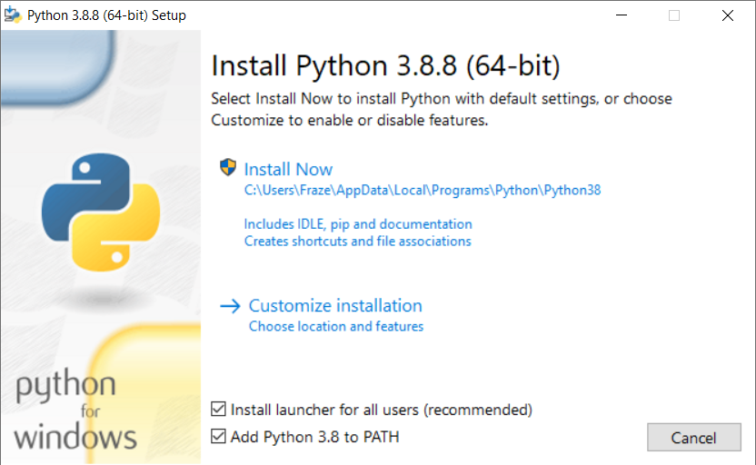
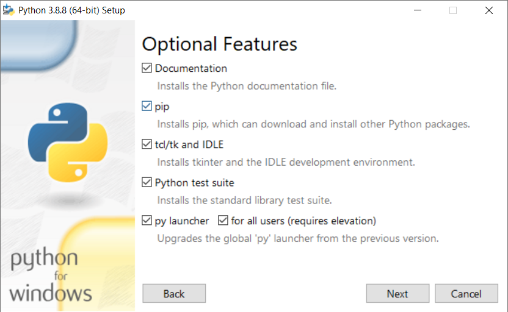
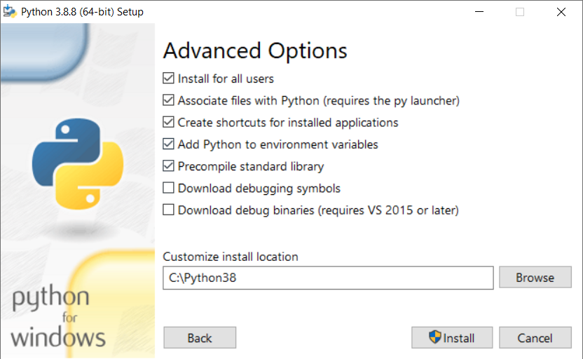

# **Presentation**

Dr Frazer Noble

---

# **Introduction**

In this presentation, I will describe:
- 

---

# **Getting Started**


---

```python
import cv2 as cv
import numpy as np


def main():
```

---

```python
    img = np.zeros((480, 640, 1), dtype=np.uint8)

    cv.rectangle(img, (100, 100,), (400, 400), 255, -1)

    cv.imshow("img", img)
    cv.waitKey(1)
    cv.imwrite("../images/01/01.PNG", img)
```

---

```python
    background_img_1 = np.zeros((480, 640, 1), dtype=np.uint8)
    background_img_2 = np.zeros((480, 640, 1), dtype=np.uint8)

    cv.rectangle(background_img_1, (150, 150,), (350, 350), 255, -1)
    cv.rectangle(background_img_2, (200, 200,), (450, 450), 255, -1)

    background_img = background_img_1 + background_img_2

    cv.imshow("background_img", background_img)
    cv.waitKey(1)
    cv.imwrite("../images/01/02.PNG", background_img)
```

---

```python
    sub_img = img - background_img

    cv.imshow("sub_img", sub_img)
    cv.waitKey(0)
    cv.imwrite("../images/01/03.PNG", sub_img)

    cv.destroyAllWindows()
```

---

```python
    cv.destroyAllWindows()

    return 0

if __name__ == '__main__':
    main()
```

---

    
*Figure*: (Left) `img` displayed in the `img` window; (Middle) `background_img` displayed in the `background_img` window; and (Right) `sub_img` displayed in the `sub_img` window.

---


# **Conclusion**

In this presentation, I have described:
- 

---

# **References**

1. []().
