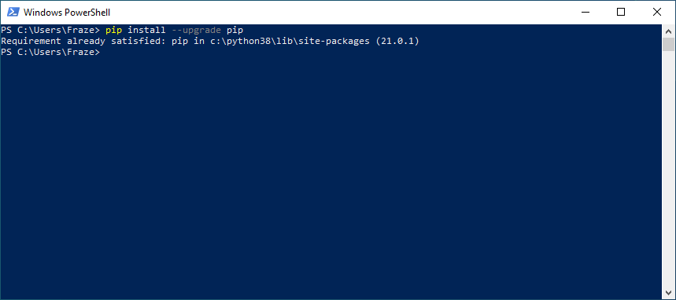

# **How to Install OpenCV Python**

Dr Frazer Noble

---

# **Introduction**

In this presentation, I will describe:
- How to install OpenCV's Python version and how to validate the installation.

---

# **Installation**

The Open Computer Vision (OpenCV) library is available in C++ and Python (officially since 14/02/2021 [[1]](https://opencv.org/opencv-python-is-now-an-official-opencv-project/)).

To install OpenCV's Python version:

1. Remove any manually installed versions of OpenCV Python, i.e. remove any versions not installed via `pip`.

2. Upgrade your `pip` version. Open a new terminal window and type the following command:

    ```console
    pip install --upgrade pip
    ```

    This will upgrade `pip` to the latest version.

---


*Figure:* PowerShell window showing `pip` being upgraded. The exact message displayed may differ, but as long as it says `pip` was successfully upgraded, that's okay. Here, we can see that `pip` has been upgraded to version 21.0.1.

---

3. To install OpenCV Python, either:

    a. Open a new terminal window and type the following command:

    ```console
    pip install opencv-python
    ```

    This will install OpenCV's main modules package.

    or:

    b. Open a new terminal window and type the following command:

    ```console
    pip install opencv-contrib-python
    ```

    This will install OpenCV's main modules and the contrib/extra modules.

---


*Figure:* PowerShell window showing `opencv-contrib-python` being installed. The exact message displayed may differ, but as long as it says OpenCV was successfully installed, that's okay. Here, we can see that OpenCV version 4.5.1.48 has been installed.

---

# **Usage**

To import the package:

```python
import cv2
```

This will import the OpenCV Python package.

---

# **Example**

In a directory, create a new file named `example.py`. Type the following into the file:

```python
import cv2 as cv

def main():

    cv.namedWindow('Hello World', cv.WINDOW_AUTOSIZE)

    cv.waitKey(0)

    return

if __name__ == '__main__':

    main()
```

Save `example.py`. 

---

Open a new terminal in the directory. Type the following command into the terminal and they press <kbd>Enter</kbd>:

```console
python example.py
```

This will run `example.py`'s program. It will create a window with the title `Hello World`.

Press any key to close the window and terminate the program.

---


*Figure:* `example.py`'s window. Here, we can see that its title is `Hello World`. Later, when we want to display an image, the window will automatically resize to fit its content.

---

# **Frequently Asked Questions**

Q: Do I need to install OpenCV C++ too?

A: No, `opencv-python` includes all the binaries you need.

Q: `pip install opencv-python` fails with `ModuleNotFoundError: No module named ...`?

A: Your version of `pip` is out of date and needs to be upgraded.

Q: `import cv2` fails with `ImportError: DLL load failed: The specified module could not be found.`?

A: You need to install the [Visual C++ redistributable](https://www.microsoft.com/en-us/download/details.aspx?id=48145) 2015.

Q: Why do I import `cv2` and not `opencv-python`?

A: `cv2` was what the developers chose when the created the binding generators. It has been kept in order to be consistent.

---


# **Conclusion**

In this presentation, I have described:
- How to install OpenCV's Python version and how to validate the installation.

---

# **References**

1. [https://opencv.org/opencv-python-is-now-an-official-opencv-project/](https://opencv.org/opencv-python-is-now-an-official-opencv-project/).

2. [https://github.com/opencv/opencv-python](https://github.com/opencv/opencv-python).
