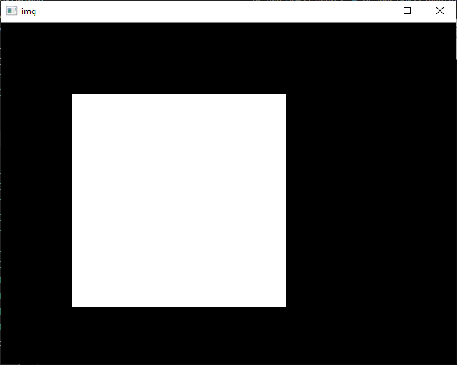
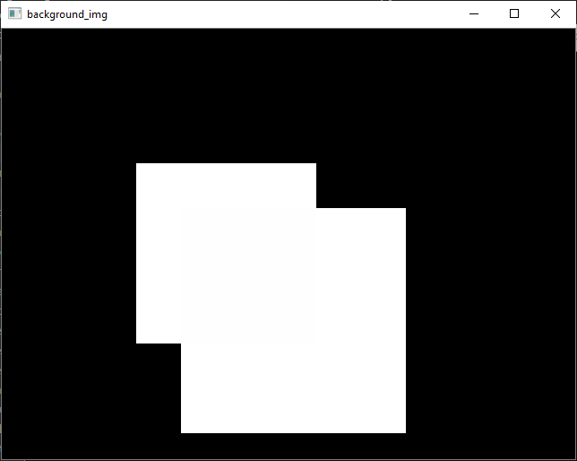
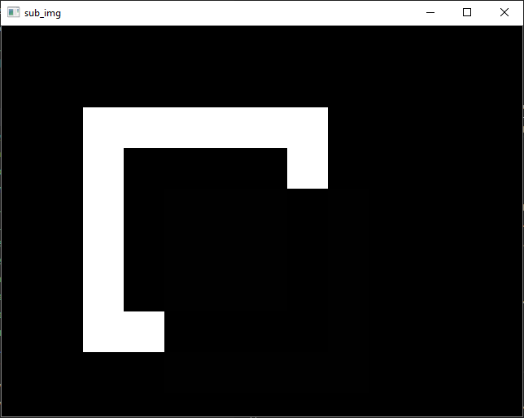

# **Numpy and OpenCV**

Dr Frazer Noble

---

# **Introduction**

In this presentation, I will describe:
- Basic operations using NumPy and OpenCV.

---

# **Requirements**

To follow along with this tutorial, you will need the following tools:
- [Python 3.8.6](https://www.python.org/).
- [Visual Studio Code 1.53.1](https://code.visualstudio.com/).

You will also need to install the following Python packages:
- [OpenCV](https://pypi.org/project/opencv-python/).
- [NumPy](https://pypi.org/project/numpy/).

It is assumed that you are using Windows; however, these instructions should be easily adapted to Linux.

---

# **Getting Started**

Open Visual Studio Code. To open the app: Open the Start menu, type `Visual Studio Code`, and then select the app.

Open the Explorer tab. To display the tab: Left click `View > Explorer` or press <kbd>Ctrl</kbd>+<kbd>Shift</kbd>+<kbd>E</kbd>. This will display the Explorer tab.

Left click on the `Open Folder` button. This will display the Open Folder prompt. Browse to the following directory:

```
C:/Users/%USER%/Documents
```

*Note: Replace `%USER%` with your own username. My username is fknoble; hence, the path is `C:/Users/fknoble/Documents`.*

---

In `C:/Users/%USER%/Documents` create a new folder named `opencv_01`. To create a new folder: Right click in the Explorer tab, left click `New Folder`, and rename it.

In `C:/Users/%USER%/Documents/opencv_01` create a new file named `mat.py`. To create a new file: Right click on `/opencv_01` in the Explorer tab, left click `New File`, and rename it. The file will open automatically.

---

`/opencv_01` should contain the following files and folders:

```
/opencv_01
    mat.py
```

---

# **`mat.py`**

Type the following code into `mat.py`:

```python
import cv2 as cv
import numpy as np
```

OpenCV's Python module `cv2` is imported as `cv` and NumPy's Python module `numpy` is imported as `np`.

---

Type the following code into `mat.py`:

```python
def main():

    img = np.zeros((480, 640, 1), dtype=np.uint8)

    cv.rectangle(img, (100, 100), (400, 400), 255, -1)

    cv.imshow("img", img)
    cv.waitKey(1)
```

This begins `main()`'s definition. `zeros()` creates a 480 x 640 x 1 array of 0's and assigns it to array `img`. A filled rectangle is drawn on the `img`. The array is then displayed in the `img` window.

---

    
*Figure*: (Left) The `img` array; and (Right) `img` displayed in the `img` window.

---

Type the following code into `mat.py`:

```python
    background_img_1 = np.zeros((480, 640, 1), dtype=np.uint8)
    background_img_2 = np.zeros((480, 640, 1), dtype=np.uint8)

    cv.rectangle(background_img_1, (150, 150,), (350, 350), 255, -1)
    cv.rectangle(background_img_2, (200, 200,), (450, 450), 255, -1)

    background_img = background_img_1 + background_img_2

    cv.imshow("background_img", background_img)
    cv.waitKey(1)
```

`zeros()` creates a two arrays of 0's and assigns them to arrays `background_img_1` and `background_img_2`. Filled rectangles are drawn on them. The arrays are added together and the result  is assigned to `background_img` The array is then displayed in the `background_img` window.

---

  
*Figure*: (Left) The `background_img` array; and (Right) `background_img` displayed in the `background_img` window.

---

Type the following code into `mat.py`:

```python
    sub_img = img - background_img

    cv.imshow("sub_img", sub_img)
    cv.waitKey(0)

    cv.destroyAllWindows()

    return 0
```

`background_img` is subtracted from `img` and the result assigned to array `sub_img`. The array is then displayed in the `sub_img` window. `main()` waits for user input before destroying all windows.

---

  
*Figure*: (Left) The `sub_img` array; and (Right) `sub_img` displayed in the `sub_img` window.

---

Type the following code into `mat.py`:

```python
if __name__ == '__main__':
    
    main()
```

`main()` will be called when the `mat.py` is run.

---

# **Run `mat.py`**

Open a new terminal in Visual Studio Code. To open a new terminal: Left click `View > Terminal` or press <kbd>Ctrl</kbd>+<kbd>`</kbd>.

Type the following commands into the terminal and then press <kbd>Enter</kbd> after each one:

```
cd ./opencv_01
python mat.py
```

This will change the current directory to the `/opencv_01` sub-directory and then run `mat.py`.

Press any key to close the windows and stop `mat.py`.

---

# **Conclusion**

In this presentation, I have described:
- Basic operations using NumPy and OpenCV.

---

# **References**

1. [https://docs.opencv.org/](https://docs.opencv.org/).
