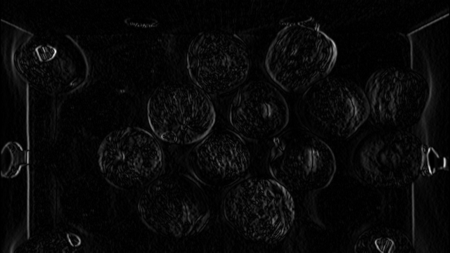
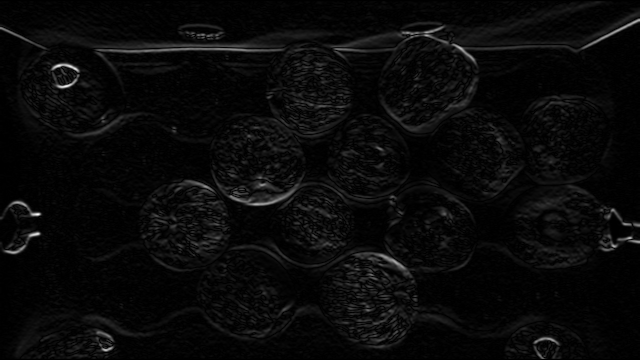

# **Edge Detection**

Dr Frazer Noble

---

# **Introduction**

In this presentation, I will describe:
- How to use OpenCV to detect edges in an image.

---

# **Requirements**

To follow along with this tutorial, you will need the following tools:
- [Python 3.8.6](https://www.python.org/).
- [Visual Studio Code 1.53.1](https://code.visualstudio.com/).

You will also need to install the following Python packages:
- [OpenCV](https://pypi.org/project/opencv-python/).
- [NumPy](https://pypi.org/project/numpy/).

It is assumed that you are using Windows; however, these instructions should be easily adapted to Linux.

---

# **Getting Started**

Open Visual Studio Code. To open the app: Open the Start menu, type `Visual Studio Code`, and then select the app.

Open the Explorer tab. To display the tab: Left click `View > Explorer` or press <kbd>Ctrl</kbd>+<kbd>Shift</kbd>+<kbd>E</kbd>. This will display the Explorer tab.

Left click on the `Open Folder` button. This will display the Open Folder prompt. Browse to the following directory:

```
C:/Users/%USER%/Documents
```

*Note: Replace `%USER%` with your own username. My username is fknoble; hence, the path is `C:/Users/fknoble/Documents`.*

---

In `C:/Users/%USER%/Documents` create a new folder named `opencv_03`. To create a new folder: Right click in the Explorer tab, left click `New Folder`, and rename it.

In `C:/Users/%USER%/Documents/opencv_03` create a new folder named `data`. Download `apples.png` from [here](https://github.com/DrFKNoble/machine_vision_tutorials/blob/master/04_edge_detection/images/01/01.PNG); save it in `C:/Users/%USER%/Documents/opencv_03/data`.

In `C:/Users/%USER%/Documents/opencv_02` create new files named `sobel.py` and `canny.py`. To create a new file: Right click on `/opencv_03` in the Explorer tab, left click `New File`, and rename it. The file will open automatically.

---

`/opencv_03` should contain the following files and folders:

```
/opencv_03
    /data
        apple.png
    sobel.py
    canny.py
```

---

# **`sobel.py`**

Type the following code into `sobel.py`:

```python
import cv2 as cv
import numpy as np
```

This snippet  will import OpenCV's python module as `cv` and NumPy's python module as `np`.

---

Type the following code into `sobel.py`:

```python
def main():

    img = cv.imread('data/apples.png')

    if img is None:
        print('ERROR::CV::Could not read image.')
        return 1
```

This snippet begins `main()`'s definition. It defines an array named `img`, which is assigned `imread()`'s results. If the array is empty, a message is displayed and the `main()` returns 1.

---

Type the following code into `sobel.py`:

```python
    rows, cols, channels = img.shape
    
    rows = rows // 2
    cols = cols // 2

    img = cv.resize(img, (cols, rows))

    cv.imshow('img', img)
    cv.waitKey(1)
```

This snippet defines three variables named `rows`, `cols`, and `channels`, which are assigned `img`'s shape. `rows` and `cols` are divided by 2 (rounded down). `resize()` resizes `img` to the new shape defined by `cols` and `row`. The array is then displayed in the `img` window.

---


*Figure:* The `img` array.

---

Type the following code into `sobel.py`:

```python
    img = cv.cvtColor(img, cv.COLOR_BGR2GRAY)

    vertical = np.float32([-1, 0, 1, -2, 0, 2, -1, 0, 1])
    vertical = vertical.reshape((3, 3))

    vertical_edges = cv.filter2D(img, cv.CV_32FC1, vertical)
    vertical_edges = np.abs(vertical_edges)
    G_x = vertical_edges/vertical_edges.max() * 255
    G_x = np.uint8(G_x)

    cv.imshow("Vertical Edges", G_x)
    cv.waitKey(1)
    cv.imwrite("data/sobel_vertical_edges.png", G_x)
```

This snippet .

---

  !
*Figure:* The `G_x` array.

---

Type the following code into `sobel.py`:

```python
    horizontal = np.float32([-1, -2, -1, 0, 0, 0, 1, 2, 1])
    horizontal = horizontal.reshape((3, 3))

    horizontal_edges = cv.filter2D(img, cv.CV_32FC1, horizontal)
    horizontal_edges = np.abs(horizontal_edges)
    G_y = horizontal_edges/horizontal_edges.max() * 255
    G_y = np.uint8(G_y)

    cv.imshow("Horizontal Edges", G_y)
    cv.waitKey(1)
    cv.imwrite("data/sobel_horizontal_edges.png", G_y)
```

This snippet .

---

  !
*Figure:* The `G_y` array.

---

Type the following code into `sobel.py`:

```python
    G = np.hypot(G_x, G_y)
    G = G/G.max() * 255
    G = np.uint8(G)

    cv.imshow("Magnitude", G)
    cv.waitKey(0)
    cv.imwrite("data/sobel_edges.png", G)

    cv.destroyAllWindows()

    return 0
```

This snippet .

---


*Figure:* The `G` array.

---

Type the following code into `sobel.py`:

```python
if __name__ == '__main__':

    main()
```

This snippet will call `main()` when the `sobel.py` is run.

---

# **Run `sobel.py`**

Open a new terminal in Visual Studio Code. To open a new terminal: Left click `View > Terminal` or press <kbd>Ctrl</kbd>+<kbd>`</kbd>.

Type the following commands into the terminal and then press <kbd>Enter</kbd> after each one:

```
cd ./opencv_03
python sobel.py
```

This will change the current directory to the `/opencv_03` sub-directory and then run `sobel.py`.

Press any key to close the windows and stop `sobel.py`.

---

# **Conclusion**

In this presentation, I have described:
- How to use OpenCV to detect edges in an image.

---

# **References**

1. [https://docs.opencv.org/](https://docs.opencv.org/).
