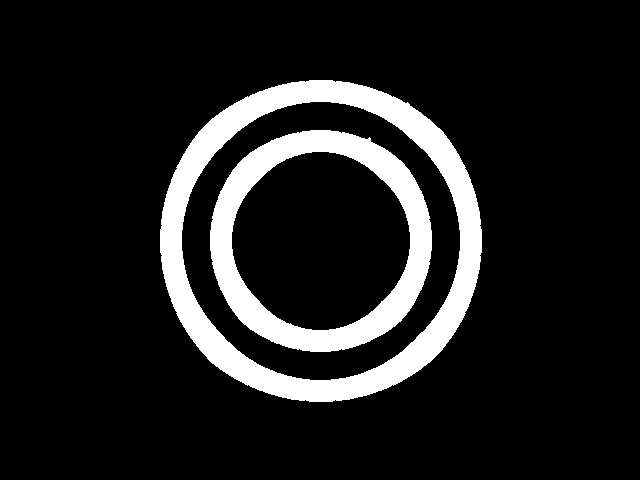
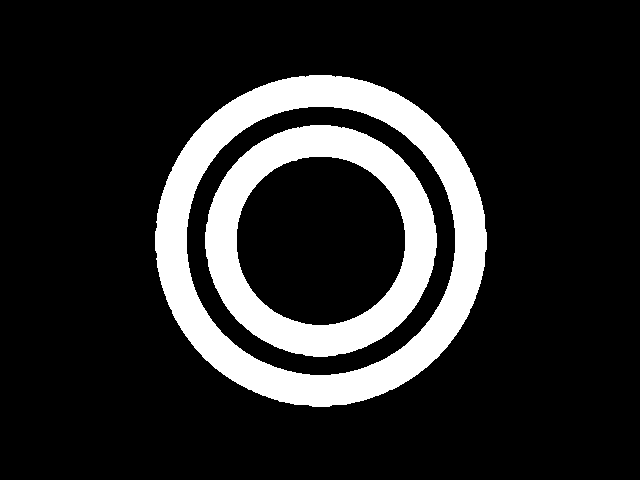
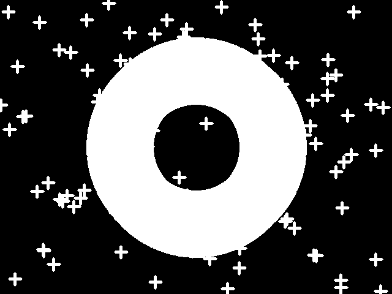

# **Morphological Operators**

Dr Frazer Noble

---

# **Introduction**

In this presentation, I will describe:
- How to use OpenCV to apply morphological operators to an image.

---

# **Requirements**

To follow along with this tutorial, you will need the following tools:
- [Python 3.8.6](https://www.python.org/).
- [Visual Studio Code 1.53.1](https://code.visualstudio.com/).

You will also need to install the following Python packages:
- [OpenCV](https://pypi.org/project/opencv-python/).
- [NumPy](https://pypi.org/project/numpy/).

It is assumed that you are using Windows; however, these instructions should be easily adapted to Linux.

---

# **Getting Started**

Open Visual Studio Code. To open the app: Open the Start menu, type `Visual Studio Code`, and then select the app.

Open the Explorer tab. To display the tab: Left click `View > Explorer` or press <kbd>Ctrl</kbd>+<kbd>Shift</kbd>+<kbd>E</kbd>. This will display the Explorer tab.

Left click on the `Open Folder` button. This will display the Open Folder prompt. Browse to the following directory:

```
C:/Users/%USER%/Documents
```

*Note: Replace `%USER%` with your own username. My username is fknoble; hence, the path is `C:/Users/fknoble/Documents`.*

---

In `C:/Users/%USER%/Documents` create a new folder named `opencv_04`. To create a new folder: Right click in the Explorer tab, left click `New Folder`, and rename it.

In `C:/Users/%USER%/Documents/opencv_04` create a new folder named `data`. Download `apples.PNG` from [here](images/01/01.PNG); save it in `C:/Users/%USER%/Documents/opencv_04/data`.

In `C:/Users/%USER%/Documents/opencv_04` create new files named `erode.py` and `dilate.py`. To create a new file: Right click on `/opencv_04` in the Explorer tab, left click `New File`, and rename it. The file will open automatically.

---

`/opencv_04` should contain the following files and folders:

```
/opencv_04
    /data
        apple.PNG
    erode.py
    dilate.py
```

---

# **`erode.py`**

Type the following code into `erode.py`:

```python
import cv2 as cv
import numpy as np
```

OpenCV's Python module `cv2` is imported as `cv` and NumPy's Python module `numpy` is imported as `np`.

---

Type the following code into `erode.py`:

```python
def main():

    rows, cols = 480, 640
    img = np.zeros((rows, cols), dtype=np.uint8)

    cv.circle(img, (320, 240), 150, (255), 40)
    cv.circle(img, (320, 240), 100, (255), 40)
```

This begins `main()`'s definition. `zeros()` creates a 480 x 640 x 1 array of 0's and assigns it to array `img`. Two circles are drawn on `img`.

---

Type the following code into `erode.py`:

```python
    coordinates = [(int(random.random() * cols),
                    int(random.random() * rows)) for _ in range(100)]

    for c in coordinates:

        cv.circle(img, c, 2, (255), -1)

    cv.imshow("img", img)
    cv.waitKey(1)
    cv.imwrite("data/morph_img.PNG", img)
```

An array of 100, random (x, y) coordinates is assigned to array `coordinates`. For each coordinate, a filled circle is drawn on `img` at that location. `img` is then displayed in the `img` window and saved as `morph_img.PNG` in `/data`.

---


*Figure:* The `img` array.

---

Type the following code into `erode.py`:

```python
    shapes = [cv.MORPH_RECT, cv.MORPH_CROSS, cv.MORPH_ELLIPSE]
    shapes_label = ["MORPH_RECT", "MORPH_CROSS", "MORPH_ELLIPSE"]

    for i, s in enumerate(shapes):

        kernel = cv.getStructuringElement(s, (20, 20))
        print("{}: \n{}\n".format(shapes_label[i], kernel))

        eroded = cv.erode(img, kernel)
```
---
```python
        cv.imshow("Eroded + {}".format(shapes_label[i]), eroded)
        cv.waitKey(0)
        cv.imwrite("data/eroded_{}.png".format(shapes_label[i]), eroded)

    cv.destroyAllWindows()

    return 0
```

A list of common OpenCV kernel shapes is assigned to list `shapes`. Labels for the kernel shapes are assigned to `shapes_label`. For each kernel shape, `getStructuringElement()` creates a kernel and assigns it to array `kernel`. `erode()` uses the kernel to erode `img` and then assigns the results to array `eroded`. The array is then displayed in its own window and saved in `/data`.

---

   
*Figure:* (Left) `img` array with a `MORPH_RECT` shaped kernel applied; (Middle) `img` array with a `MORPH_CROSS` shaped kernel applied; and (Right) `img` array with a `MORPH_ELLIPSE` shaped kernel applied. 

---

Type the following code into `erode.py`:

```python
if __name__ == '__main__':

    main()
```

`main()` will be called when the `erode.py` is run.

---

# **Run `erode.py`**

Open a new terminal in Visual Studio Code. To open a new terminal: Left click `View > Terminal` or press <kbd>Ctrl</kbd>+<kbd>`</kbd>.

Type the following commands into the terminal and then press <kbd>Enter</kbd> after each one:

```
cd ./opencv_04
python erode.py
```

This will change the current directory to the `/opencv_04` sub-directory and then run `erode.py`.

Press any key to close the windows and stop `erode.py`.

---

# **`dilate.py`**

Type the following code into `dilate.py`:

```python
import cv2 as cv
import numpy as np
```

OpenCV's Python module `cv2` is imported as `cv` and NumPy's Python module `numpy` is imported as `np`.

---

Type the following code into `dilate.py`:

```python
def main():

    rows, cols = 480, 640
    img = np.zeros((rows, cols), dtype=np.uint8)

    cv.circle(img, (320, 240), 150, (255), 40)
    cv.circle(img, (320, 240), 100, (255), 40)
```

This begins `main()`'s definition. `zeros()` creates a 480 x 640 x 1 array of 0's and assigns it to array `img`. Two circles are drawn on `img`.

---

Type the following code into `dilate.py`:

```python
    coordinates = [(int(random.random() * cols),
                    int(random.random() * rows)) for _ in range(100)]

    for c in coordinates:

        cv.circle(img, c, 2, (255), -1)

    cv.imshow("img", img)
    cv.waitKey(1)
    cv.imwrite("data/morph_img.PNG", img)
```

An array of 100, random (x, y) coordinates is assigned to array `coordinates`. For each coordinate, a filled circle is drawn on `img` at that location. `img` is then displayed in the `img` window and saved as `morph_img.PNG` in `/data`.

---


*Figure:* The `img` array.

---

Type the following code into `dilate.py`:

```python
    shapes = [cv.MORPH_RECT, cv.MORPH_CROSS, cv.MORPH_ELLIPSE]
    shapes_label = ["MORPH_RECT", "MORPH_CROSS", "MORPH_ELLIPSE"]

    for i, s in enumerate(shapes):

        kernel = cv.getStructuringElement(s, (20, 20))
        print("{}: \n{}\n".format(shapes_label[i], kernel))

        dilated = cv.dilate(img, kernel)
```
---
```python
        cv.imshow("Dilated + {}".format(shapes_label[i]), dilated)
        cv.waitKey(0)
        cv.imwrite("data/dilated_{}.png".format(shapes_label[i]), dilated)

    cv.destroyAllWindows()

    return 0

```

A list of common OpenCV kernel shapes is assigned to list `shapes`. Labels for the kernel shapes are assigned to `shapes_label`. For each kernel shape, `getStructuringElement()` creates a kernel and assigns it to array `kernel`. `dilate()` uses the kernel to dilate `img` and then assigns the results to array `dilated`. The array is then displayed in its own window and saved in `/data`.

---

   
*Figure:* (Left) `img` array with a `MORPH_RECT` shaped kernel applied; (Middle) `img` array with a `MORPH_CROSS` shaped kernel applied; and (Right) `img` array with a `MORPH_ELLIPSE` shaped kernel applied. 

---

Type the following code into `dilate.py`:

```python
if __name__ == '__main__':

    main()
```

`main()` will be called when the `dilate.py` is run.

---

# **Run `dilate.py`**

Open a new terminal in Visual Studio Code. To open a new terminal: Left click `View > Terminal` or press <kbd>Ctrl</kbd>+<kbd>`</kbd>.

Type the following commands into the terminal and then press <kbd>Enter</kbd> after each one:

```
cd ./opencv_04
python dilate.py
```

This will change the current directory to the `/opencv_04` sub-directory and then run `dilate.py`.

Press any key to close the windows and stop `dilate.py`.

---

# **Conclusion**

In this presentation, I have described:
- How to use OpenCV to apply morphological operators to an image.

---

# **References**

1. [https://docs.opencv.org/](https://docs.opencv.org/).
