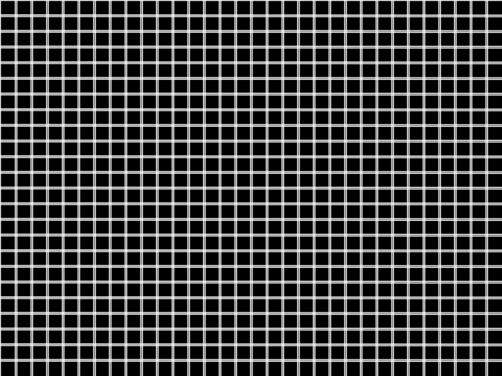

# **Shape Detection**

Dr Frazer Noble

---

# **Introduction**

In this presentation, I will describe:
- How to use OpenCV to detect shapes in an image.

---

# **Requirements**

To follow along with this tutorial, you will need the following tools:
- [Python 3.8.6](https://www.python.org/).
- [Visual Studio Code 1.53.1](https://code.visualstudio.com/).

You will also need to install the following Python packages:
- [OpenCV](https://pypi.org/project/opencv-python/).
- [NumPy](https://pypi.org/project/numpy/).

It is assumed that you are using Windows; however, these instructions should be easily adapted to Linux.

---

# **Getting Started**

Open Visual Studio Code. To open the app: Open the Start menu, type `Visual Studio Code`, and then select the app.

Open the Explorer tab. To display the tab: Left click `View > Explorer` or press <kbd>Ctrl</kbd>+<kbd>Shift</kbd>+<kbd>E</kbd>. This will display the Explorer tab.

Left click on the `Open Folder` button. This will display the Open Folder prompt. Browse to the following directory:

```
C:/Users/%USER%/Documents
```

*Note: Replace `%USER%` with your own username. My username is fknoble; hence, the path is `C:/Users/fknoble/Documents`.*

---

In `C:/Users/%USER%/Documents` create a new folder named `opencv_06`. To create a new folder: Right click in the Explorer tab, left click `New Folder`, and rename it.

In `C:/Users/%USER%/Documents/opencv_06` create a new folder named `data`. Download `line.PNG` from [here](images/01/01.PNG); save it in `C:/Users/%USER%/Documents/opencv_06/data`.

In `C:/Users/%USER%/Documents/opencv_06` create a new files named `line.py`. To create a new file: Right click on `/opencv_06` in the Explorer tab, left click `New File`, and rename it. The file will open automatically.

---

`/opencv_06` should contain the following files and folders:

```
/opencv_06
    /data
        line.PNG
    line.py
```

---

# **`line.py`**

Type the following code into `line.py`:

```python
import cv2 as cv
import numpy as np
```

OpenCV's Python module `cv2` is imported as `cv` and NumPy's Python module `numpy` is imported as `np`.

---

Type the following code into `line.py`:

```python
def main():

    img = cv.imread('data/line.PNG')

    if img is None:
        print('ERROR::CV::Could not read image.')
        return 1
```

This begins `main()`'s definition. `imread()` reads an image from a directory and assigns the results to array `img`. If the array is empty, a message is displayed and `main()` returns 1.

---

Type the following code into `line.py`:

```python
    rows, cols, channels = img.shape

    cv.imshow('img', img)
    cv.waitKey(1)
```

`img`'s shape is assigned to integers `rows`, `cols`, and `channels`. The array is then displayed in the `img` window.

---


*Figure:* The `img` array.

---

Type the following code into `line.py`:

```python
    edges = cv.Canny(img, 127, 255)

    lines = cv.HoughLines(edges, 1, np.pi / 180, 225, None, 0, 0)

    draw = np.zeros((rows, cols), dtype=np.uint8)
```

`canny()` detects edges in `img` and assigns the results to array `edges`. `HoughLines` detects lines in `edges` and assigns the results to array `lines`. `zeros()` creates an array of 0's that is assigned to the array `draw`.

---

Type the following code into `line.py`:

```python
    if lines is not None:

        for i in range(0, len(lines)):

            rho = lines[i][0][0]
            theta = lines[i][0][1]
            a = np.cos(theta)
            b = np.sin(theta)
            x0 = a * rho
            y0 = b * rho
            p1 = (int(x0 + 1000*(-b)), int(y0 + 1000*(a)))
            p2 = (int(x0 - 1000*(-b)), int(y0 - 1000*(a)))

            cv.line(draw, p1, p2, [255], 1, cv.LINE_AA)
```

For each line in `lines`, the start and end points of the line are computed. `line()` draws a line on `draw`.

---

Type the following code into `line.py`:

```python
    cv.imshow("draw", draw)
    cv.waitKey(0)
    cv.imwrite("data/draw.png", draw)
    
    cv.destroyAllWindows()

    return 0
```

`draw` is displayed in the `draw` window and saved as `draw.PNG` in `/data`.

---


*Figure:* The `draw` array.

---

Type the following code into `line.py`:

```python
if __name__ == '__main__':
    
    main()
```

`main()` will be called when the `line.py` is run.

---

# **Run `line.py`**

Open a new terminal in Visual Studio Code. To open a new terminal: Left click `View > Terminal` or press <kbd>Ctrl</kbd>+<kbd>`</kbd>.

Type the following commands into the terminal and then press <kbd>Enter</kbd> after each one:

```
cd ./opencv_06
python line.py
```

This will change the current directory to the `/opencv_06` sub-directory and then run `line.py`.

Press any key to close the windows and stop `line.py`.

---

# **Conclusion**

In this presentation, I have described:
- How to use OpenCV to detect shapes in an image.

---

# **References**

1. [https://docs.opencv.org/](https://docs.opencv.org/).
