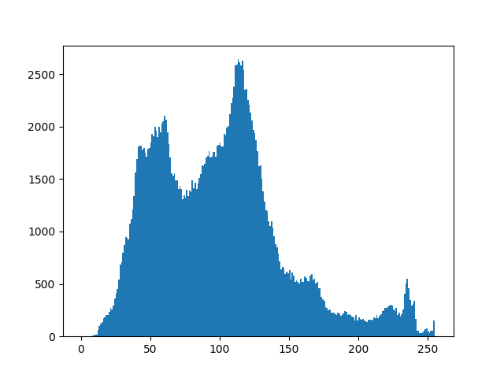
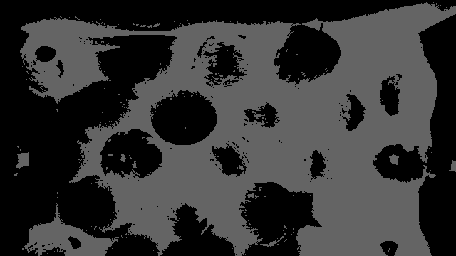
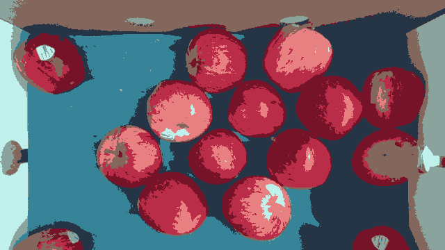

# **Image Segmentation**

Dr Frazer Noble

---

# **Introduction**

In this presentation, I will describe:
- How to use OpenCV to segment an image.

---

# **Requirements**

To follow along with this tutorial, you will need the following tools:
- [Python 3.8.6](https://www.python.org/).
- [Visual Studio Code 1.53.1](https://code.visualstudio.com/).

You will also need to install the following Python packages:
- [OpenCV](https://pypi.org/project/opencv-python/).
- [NumPy](https://pypi.org/project/numpy/).

It is assumed that you are using Windows; however, these instructions should be easily adapted to Linux.

---

# **Getting Started**

Open Visual Studio Code. To open the app: Open the Start menu, type `Visual Studio Code`, and then select the app.

Open the Explorer tab. To display the tab: Left click `View > Explorer` or press <kbd>Ctrl</kbd>+<kbd>Shift</kbd>+<kbd>E</kbd>. This will display the Explorer tab.

Left click on the `Open Folder` button. This will display the Open Folder prompt. Browse to the following directory:

```
C:/Users/%USER%/Documents
```

*Note: Replace `%USER%` with your own username. My username is fknoble; hence, the path is `C:/Users/fknoble/Documents`.*

---

In `C:/Users/%USER%/Documents` create a new folder named `opencv_07`. To create a new folder: Right click in the Explorer tab, left click `New Folder`, and rename it.

In `C:/Users/%USER%/Documents/opencv_07` create a new folder named `data`. Download `apples.PNG` from [here](images/01/01.PNG); save it in `C:/Users/%USER%/Documents/opencv_07/data`.

In `C:/Users/%USER%/Documents/opencv_07` create new files named `threshold.py` and `kmeans.py`. To create a new file: Right click on `/opencv_07` in the Explorer tab, left click `New File`, and rename it. The file will open automatically.

---

`/opencv_07` should contain the following files and folders:

```
/opencv_07
    /data
        apples.PNG
    threshold.py
    kmeans.py
```

---

# **`threshold.py`**

Type the following code into `threshold.py`:

```python
import cv2 as cv
import numpy as np
import matplotlib.pyplot as plt
```

OpenCV's Python module `cv2` is imported as `cv`; NumPy's Python module `numpy` is imported as `np`; and Matplotlib's PyPlot Python module is imported as `plt`.

---

Type the following code into `threshold.py`:

```python
def main():

    img = cv.imread('data/apples.PNG')

    if img is None:
        print('ERROR::CV::Could not read image.')
        return 1
```

This begins `main()`'s definition. `imread()` reads an image from a directory and assigns the results to array `img`. If the array is empty, a message is displayed and `main()` returns 1.

---

Type the following code into `threshold.py`:

```python
    rows, cols, channels = img.shape
    
    rows = rows // 2
    cols = cols // 2

    img = cv.resize(img, (cols, rows))

    cv.imshow('img', img)
    cv.waitKey(1)
```

`img`'s shape is assigned to integers `rows`, `cols`, and `channels`. `rows` and `cols` are divided by 2 (rounded down) and the results assigned to themselves. `resize()` resizes `img` to shape `cols` x `rows` and the result is assigned to itself. The array is then displayed in the `img` window.

---


*Figure:* The `img` array.

---

Type the following code into `threshold.py`:

```python
    img = cv.cvtColor(img, cv.COLOR_BGR2GRAY)
    
    plt.hist(img.ravel(), 256, [0, 256])
    plt.savefig("data/threshold_histogram.PNG")
    plt.show()

    thresholds = [0, 100, 150, 255]

    result_img = np.zeros((rows, cols), dtype=np.uint8)
```

`cvtColor()` converts `img` to a grayscale image and assigns the results to `img`. `hist()` plots the flattened array and saves it as `threshold_histogram.PNG` in `/data`. A list of pre-determined thresholds are assigned to array `thresholds`. `zeros()` creates an array of 0's and the results are assigned to array `result_img`.

---


*Figure:* `threshold_histogram.PNG`. Here, troughs can be seen at ~100 and ~150.

---

Type the following code into `threshold.py`:

```python
    for i in range(len(thresholds) - 1):

        thresholded_img = cv.inRange(img, thresholds[i], thresholds[i+1])
        thresholded_img = np.uint8(thresholded_img / 255) * thresholds[i + 1]

        cv.imshow("thresholded_img", thresholded_img)
        cv.waitKey(1)
        
        result_img = result_img + thresholded_img
```

`inRange()` segments `img`, identifying pixels between `thresholds` values and assigns them to array `thresholded_img`. The array is displayed in the `thresholded_img`. `thresholded_img` is added to `result_img` and assigned to `result_img`.

---

    
*Figure:* (Left) The `thresholded_img` array with range (0, 99); (Middle) The `thresholded_img` array with range (100, 149); and (Right) The `thresholded_img` array with range (150, 255).

---

Type the following code into `threshold.py`:

```python
    cv.imshow("result_img", result_img)
    cv.waitKey(0)
    cv.imwrite("data/result_img.PNG", result_img)

    cv.destroyAllWindows()   

    return
```

`result_img` is displayed in the `result_img` window and saved as `result_img.PNG` in `/data`.

---


*Figure:* The `result_img` array.

---

Type the following code into `threshold.py`:

```python
if __name__ == '__main__':
    
    main()
```

`main()` will be called when the `threshold.py` is run.

---

# **Run `threshold.py`**

Open a new terminal in Visual Studio Code. To open a new terminal: Left click `View > Terminal` or press <kbd>Ctrl</kbd>+<kbd>`</kbd>.

Type the following commands into the terminal and then press <kbd>Enter</kbd> after each one:

```
cd ./opencv_07
python threshold.py
```

This will change the current directory to the `/opencv_07` sub-directory and then run `threshold.py`.

Press any key to close the windows and stop `threshold.py`.

---


# **`kmeans.py`**

Type the following code into `kmeans.py`:

```python
import cv2 as cv
import numpy as np
```

OpenCV's Python module `cv2` is imported as `cv` and NumPy's Python module `numpy` is imported as `np`.

---

Type the following code into `kmeans.py`:

```python
def main():

    img = cv.imread('data/apples.PNG')

    if img is None:
        print('ERROR::CV::Could not read image.')
        return 1
```

This begins `main()`'s definition. `imread()` reads an image from a directory and assigns the results to array `img`. If the array is empty, a message is displayed and `main()` returns 1.

---

Type the following code into `kmeans.py`:

```python
    rows, cols, channels = img.shape
    
    rows = rows // 2
    cols = cols // 2

    img = cv.resize(img, (cols, rows))

    cv.imshow('img', img)
    cv.waitKey(1)
```

`img`'s shape is assigned to integers `rows`, `cols`, and `channels`. `rows` and `cols` are divided by 2 (rounded down) and the results assigned to themselves. `resize()` resizes `img` to shape `cols` x `rows` and the result is assigned to itself. The array is then displayed in the `img` window.

---


*Figure:* The `img` array.

---

Type the following code into `kmeans.py`:

```python
    data = np.reshape(img, (-1, channels))
    data = np.float32(data)    

    criteria = (cv.TERM_CRITERIA_EPS + cv.TERM_CRITERIA_MAX_ITER, 10, 1.0)
    flags = cv.KMEANS_RANDOM_centreS
```

`reshape()` reshapes `img` and assigns the results to array `data`. `float32()` converts the array's data to `float32`. `criteria` is assigned the algorithm's termination criteria. `flags` is assigned how the algorithm's initial centres are taken.

---

Type the following code into `kmeans.py`:

```python
    for K in range(2, 14, 2):

        ret, label, centre = cv.kmeans(data, K, None, criteria, 10, flags)

        centre = np.uint8(centre)
```
---
```python
        quantised = centre[label.flatten()]
        quantised = quantised.reshape((rows, cols, channels))

        cv.imshow("quantised_{}".format(K), quantised)
        cv.waitKey(0)
        cv.imwrite("data/quantised_{}.PNG".format(K), quantised)

    cv.destroyAllWindows()

    return 0
```

`kmeans()` computes the compactness, labels, and centres of the data and assigns them to `ret`, `label`, and `centre`. `uint8()` converts `centre`'s data to `uint8`. `reshape()` reshapes `centre` and `label` into array `quantised`. The array is displayed in a window and saved in `/data`.

---

  

   
*Figure:* (Top Left) The `quantised` array with `K=2`; (Top Middle) the `quantised` array with `K=4`; (Top Left) the `quantised` array with `K=6`; (Bottom Left) the `quantised` array with `K=8`; (Bottom Middle); and (Bottom Right) the `quantised` array with `K=10`.

---

Type the following code into `kmeans.py`:

```python
if __name__ == '__main__':
    
    main()
```

`main()` will be called when the `kmeans.py` is run.

---

# **Run `kmeans.py`**

Open a new terminal in Visual Studio Code. To open a new terminal: Left click `View > Terminal` or press <kbd>Ctrl</kbd>+<kbd>`</kbd>.

Type the following commands into the terminal and then press <kbd>Enter</kbd> after each one:

```
cd ./opencv_07
python kmeans.py
```

This will change the current directory to the `/opencv_07` sub-directory and then run `kmeans.py`.

Press any key to close the windows and stop `kmeans.py`.

---

# **Conclusion**

In this presentation, I have described:
- How to use OpenCV to segment an image.

---

# **References**

1. [https://docs.opencv.org/](https://docs.opencv.org/).
