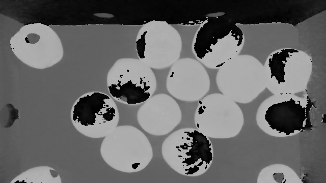

# **Colour Spaces**

Dr Frazer Noble

---

# **Introduction**

In this presentation, I will describe:
- How to use OpenCV to convert colour spaces.

---

# **Requirements**

To follow along with this tutorial, you will need the following tools:
- [Python 3.8.6](https://www.python.org/).
- [Visual Studio Code 1.53.1](https://code.visualstudio.com/).

You will also need to install the following Python packages:
- [OpenCV](https://pypi.org/project/opencv-python/).
- [NumPy](https://pypi.org/project/numpy/).

It is assumed that you are using Windows; however, these instructions should be easily adapted to Linux.

---

# **Getting Started**

Open Visual Studio Code. To open the app: Open the Start menu, type `Visual Studio Code`, and then select the app.

Open the Explorer tab. To display the tab: Left click `View > Explorer` or press <kbd>Ctrl</kbd>+<kbd>Shift</kbd>+<kbd>E</kbd>. This will display the Explorer tab.

Left click on the `Open Folder` button. This will display the Open Folder prompt. Browse to the following directory:

```
C:/Users/%USER%/Documents
```

*Note: Replace `%USER%` with your own username. My username is fknoble; hence, the path is `C:/Users/fknoble/Documents`.*

---

In `C:/Users/%USER%/Documents` create a new folder named `opencv_08`. To create a new folder: Right click in the Explorer tab, left click `New Folder`, and rename it.

In `C:/Users/%USER%/Documents/opencv_08` create a new folder named `data`. Download `apples.PNG` from [here](https://github.com/DrFKNoble/machine_vision_tutorials/blob/master/09_color_spaces/images/01/01.PNG); save it in `C:/Users/%USER%/Documents/opencv_08/data`.

In `C:/Users/%USER%/Documents/opencv_08` create a new file named `hsv.py`. To create a new file: Right click on `/opencv_08` in the Explorer tab, left click `New File`, and rename it. The file will open automatically.

---

`/opencv_08` should contain the following files and folders:

```
/opencv_08
    /data
        apples.PNG
    hsv.py
```

---

# **`hsv.py`**

Type the following code into `hsv.py`:

```python
import cv2 as cv
import numpy as np
```

OpenCV's Python module `cv2` is imported as `cv` and NumPy's Python module `numpy` is imported as `np`.

---

Type the following code into `hsv.py`:

```python
def main():

    img = cv.imread('data/apples.PNG')

    if img is None:
        print('ERROR::CV::Could not read image.')
        return 1
```

This begins `main()`'s definition. `imread()` reads an image from a directory and assigns the results to array `img`. If the array is empty, a message is displayed and `main()` returns 1.

---

Type the following code into `hsv.py`:

```python
    rows, cols, channels = img.shape
    
    rows = rows // 2
    cols = cols // 2

    img = cv.resize(img, (cols, rows))

    cv.imshow('img', img)
    cv.waitKey(1)
```

`img`'s shape is assigned to integers `rows`, `cols`, and `channels`. `rows` and `cols` are divided by 2 (rounded down) and the results assigned to themselves. `resize()` resizes `img` to shape `cols` x `rows` and the result is assigned to itself. The array is then displayed in the `img` window.

---


*Figure:* The `img` array.

---

Type the following code into `hsv.py`:

```python
    hsv_img = cv.cvtColor(img, cv.COLOR_BGR2HSV)

    cv.imshow("HSV", hsv_img)
    cv.waitKey(1)
    cv.imwrite("data/hsv.PNG", hsv_img)

    H = hsv_img[:, :, 0]
    S = hsv_img[:, :, 1]
    V = hsv_img[:, :, 2]
```

`cvtColor()` converts `img`'s colour space from BGR to HSV and assigns the results to array `hsv_img`. The array is displayed in the `HSV` window and saved as `hsv.PNG` in `/data`. The hue, saturation, and value channels are extracted from `hsv_img` and assigned to arrays `H`, `S`, and `V`.

---


*Figure:* The `hsv_img` array.

---

Type the following code into `hsv.py`:

```python
    cv.imshow("H", H)
    cv.waitKey(1)
    cv.imwrite("data/hsv_H.PNG", H)

    cv.imshow("S", S)
    cv.waitKey(1)
    cv.imwrite("data/hsv_S.PNG", S)
    
    cv.imshow("V", V)
    cv.waitKey(0)
    cv.imwrite("data/hsv_V.PNG", V)
```

`H` is displayed in the `H` window and saved as `hsv_H.PNG` in `/data`. `S` is displayed in the `S` window and saved as `hsv_S.PNG` in `/data`. `V` is displayed in the `V` window and saved as `hsv_V.PNG` in `/data`.

---

    
*Figure:* (Left) The `H` array; (Middle) the `S` array; and (Right) the `V` array.

---

Type the following code into `hsv.py`:

```python
if __name__ == '__main__':
    
    main()
```

`main()` will be called when the `hsv.py` is run.

---

# **Run `hsv.py`**

Open a new terminal in Visual Studio Code. To open a new terminal: Left click `View > Terminal` or press <kbd>Ctrl</kbd>+<kbd>`</kbd>.

Type the following commands into the terminal and then press <kbd>Enter</kbd> after each one:

```
cd ./opencv_08
python hsv.py
```

This will change the current directory to the `/opencv_08` sub-directory and then run `hsv.py`.

Press any key to close the windows and stop `hsv.py`.

---

# **Conclusion**

In this presentation, I have described:
- How to use OpenCV to convert colour spaces.

---

# **References**

1. [https://docs.opencv.org/](https://docs.opencv.org/).
