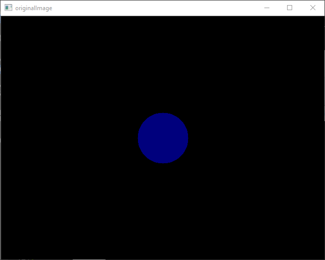
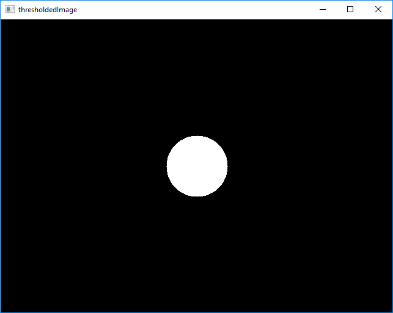

# OpenCV Tutorial 6: Edge and Colour Detection

Welcome to my tutorial on how to do edge and colour detection using OpenCV.

## Introduction

So far, the previous tutorials have shown you how to capture an image, access its pixels' values, draw on the image, threshold it, and apply morphological operations. These are all things that are done "to" the image, but what if you want to get something "from" the image, e.g to know if an object, such as an apple, is in a camera's view? We know apples are round and red, we can use this information and image processing techniques to detect them, i.e. perform object detection. OpenCV has a number of functions that can help with this.

In this tutorial I show you how to use OpenCV's C++ library to detect edges and colour in an image.

This tutorial is organised as follows: I first describe the requirements for completing this tutorial; then I list the tutorial's contents and describe how to build its activity and sample; next, I go through the sample's header and source files, describing each line's and snippet's purpose; I then prescribe activities for you to complete; and lastly, I conclude the tutorial.

## Requirements

### Windows

To build the source code listed in this tutorial, you need to have the following on your computer:

1. [CMake](https://cmake.org/download/)
2. [OpenCV](https://opencv.org/releases.html)
3. [Visual Studio](https://visualstudio.microsoft.com/vs/)

If you haven't got these installed, click on each of the links to go to their respective download websites. Download and run the relevant system installer for your computer, e.g. CMake's "cmake-3.13.3-win64-x64.msi", OpenCV's 4.0.1 "Win pack", and Microsoft's latest "Windows" installers for a 64-bit version of Windows 10. 

If you'd like to use an alternative Integrated Development Environment (IDE) to edit code, consider Microsoft's [Visual Studio Code](https://code.visualstudio.com/download). You'll find it a light-weight, and flexible, alternative to Visual Studio.

Once you've got CMake, OpenCV, and an IDE installed, you're ready to get started.

## How to Build the Tutorial's Samples and Activities

This tutorial contains the following files:

1. [activity_1/CMakeLists.txt](./activity_1/CMakeLists.txt)
1. [activity_1/main.hpp](./activity_1/main.hpp)
1. [activity_1/main.cpp](./activity_1/main.cpp)
1. [sample_1/CMakeLists.txt](./sample_1/CMakeLists.txt)
1. [sample_1/main.hpp](./sample_1/main.hpp)
1. [sample_1/main.cpp](./sample_1/main.cpp)
1. [activity_2/CMakeLists.txt](./activity_2/CMakeLists.txt)
1. [activity_2/main.hpp](./activity_2/main.hpp)
1. [activity_2/main.cpp](./activity_2/main.cpp)
1. [activity_2/data/apple.jpg](./activity_2/data/apple.jpg)
1. [sample_2/CMakeLists.txt](./sample_2/CMakeLists.txt)
1. [sample_2/main.hpp](./sample_2/main.hpp)
1. [sample_2/main.cpp](./sample_2/main.cpp)
1. [README.md](./README.md)

Sample 1 contains source code that shows how to detect edges in an image. Sample 2 contains source code that shows you how to detect colour in an image. Activities 1 and 2 are projects set up for you to complete the tutorial's activities. Activity 2's 'data' sub-directory contains an input file.

### Windows

The following describe how to build the tutorial's sample and activity using either: console commands or Visual Studio IDE.

#### Console Commands

To build a Debug version of a sample or actvity, browse to its directory and use the following console commands:

````
mkdir build  
cd build  
cmake -G "Visual Studio 15 2017 Win64" ..  
cmake --build . --config Debug --target install 
````

To run the executable, browse to the sample's or actvity's 'bin' directory.

To build a Release version of a sample or activity, browse to its directory and use the following console commands:

````
mkdir build  
cd build  
cmake -G "Visual Studio 15 2017 Win64" ..  
cmake --build . --config Release --target install 
````

To run the executable, browse to the sample's or activity's 'bin' directory.

#### Visual Studio IDE

To build a Debug Version of a sample or activity:

1. Open Visual Studio IDE.
1. Click on 'File > Open > CMake'.
1. Browse to the sample's or activity's directory. 
1. Select 'CMakeLists.txt' and click on Open.
1. Click 'CMake > Build All'. 

To run the executable:

1. Click 'CMake > Debug from Build Folder > project'.

To change the build configuration:

1. Click 'CMake > Change CMake Settings > project'
1. Select the build configuration.

To build a 64-bit, debug application, select 'x64-Debug'. To build a 64-bit, release application, select 'x64-Release'. CMake's default is a x64-bit, debug configuration.

## Sample 1: Detecting Edges in an Image

Browse to the 'sample_1' directory.

Let's have a look at Sample 1's source code:

'main.hpp'
````cpp
#ifndef __MAIN_H__
#define __MAIN_H__

#include <opencv2/opencv.hpp>

#endif //__MAIN_H__
````

'main.cpp'
````cpp
#include "main.hpp"

int main(int argc, char* argv[]) {

	cv::Mat image{ cv::Mat(cv::Size(640, 480), CV_8UC1, cv::Scalar(0)) };

	cv::circle(image, cv::Point(320, 240), 50, cv::Scalar(125), -1);

	cv::Mat cannyImage;

	cv::Canny(image, cannyImage, 124, 255);

	cv::imshow("cannyImage", cannyImage);

	cv::waitKey(0);

	cv::destroyAllWindows();

    return 0;
    
}
````

Let's first consider 'main.hpp'. I have used a header guard to prevent including a header file more than once. Header guards are conditional directives that take the form:

````cpp
#ifndef __NAME__
#define __NAME__
    // declarations and definitions go here.
#endif __NAME__ //__NAME__
````

When 'main.hpp' is included, the first thing it does is check if `__MAIN_H__` has been defined. If it hasn't been, it defines `__MAIN_H__` and includes a header file. If it has been, the entire header is ignored. For information about header guards, see [[here](https://www.learncpp.com/cpp-tutorial/1-10a-header-guards/)].

I have included the `opencv2/opencv.hpp` header file, which provides access to a range of OpenCV's modules, e.g. core, imgproc, and highgui. For more information about the modules, see [[here](https://docs.opencv.org/4.0.1/)].

Next, let's consider 'main.cpp'.

Let's now go through the 'main.cpp' block by block:

The line
````cpp
#include "main.hpp"
````
provides access to OpenCV's functionality via the `main.hpp`.

The line
````cpp
int main(int argc, char* argv[])
````
defines the program's entry point and has two parameters: `int argc` and `char* argv[]`. `argc` contains an integer number of command-line arguments, and `argv` contains a string of command-line arguments.

The line
````cpp
cv::Mat image{ cv::Mat(cv::Size(640, 480), CV_8UC1, cv::Scalar(0)) };
````
defines the variable `image`, an instance of OpenCV's `Mat` class, which is initialised using `Mat`'s overloaded member function. There are, to date, 29 overloaded member functions available. Here, `image` is defined as a 640 x 480 pixel (px), 8-bit, three channel image, whose pixels' colour is set by the Blue Green Red (BGR) scalar (0, 0, 0). For more information about the `Mat` class, see [[here](https://docs.opencv.org/4.0.1/d3/d63/classcv_1_1Mat.html)].

The line
````cpp
cv::circle(image, cv::Point(320, 240), 50, cv::Scalar(125), -1);
````
uses OpenCV's `circle()` function to draw a circle on `image`. `circle()` has seven parameters: `InputOutputArray img`, `Point center`, `int radius`, `const Scalar &color`, `int thickness`, `int lineType`, and `int shift`. `img` is the image where the circle is drawn, `center` is the circle's center, `radius` is the circle's radius, `color` is the circle's color, `thickness` is the circle's line's thickness, `lineType` is the bondary type, and `shift` is the number of fractional bits in the point coordinates. For more information about `circle()`, see [[here](https://docs.opencv.org/4.0.1/d6/d6e/group__imgproc__draw.html#gaf10604b069374903dbd0f0488cb43670)].

The line
````cpp
cv::Mat cannyImage;
````
declares the variable `cannyImage`, an instance of OpenCV's `Mat` class. Here, `cannyImage` will hold the output of the `canny()` function.

The line
````cpp
cv::Canny(image, cannyImage, 124, 255);
````
uses OpenCV's overloaded `canny()` function to detect edges within `image`. There are, to date, two overloaded member functions available. Here, `canny()` has been used with six parameters: `InputArray image`, `OutputArray edges`, `double threshold1`, `double threshold2`, `int apertureSize`, and `bool L2gradient`. `image` in an 8-bit input, `edges` is the output edge map, `threshold1` is the first threshold for the algorithm's hysteresis procedure, `threshold2` is the second threshold for the alorithm's hysteresis procedure, `apertureSize` is the aperture size for the Sobel operator, and `L2gradient` a flag indicating whether a more accurate L_2 norm should be used. For more information about `canny()`, see [[here](https://docs.opencv.org/4.0.1/dd/d1a/group__imgproc__feature.html#ga04723e007ed888ddf11d9ba04e2232de)].

The line
````cpp
cv::imshow("cannyImage", cannyImage);
````
uses OpenCV's `imshow()` function to display `cannyImage` in a window. `imshow()` has two parameters: `const String &winname` and `InputArray mat`. `winname` is the name of the window and `mat` is the image to be
shown. For more information about `imshow()`, see [[here](https://docs.opencv.org/4.0.1/d7/dfc/group__highgui.html#ga453d42fe4cb60e5723281a89973ee563)].

The line
````cpp
cv::waitKey(0);
````
uses OpenCV's `waitKey()` function to wait for a user to press a key. `waitKey()` has one parameter: `int delay`. `delay` is the time in milliseconds the function waits for; 0 means "forever". For more information about `waitKey()`, see [[here](https://docs.opencv.org/4.0.1/d7/dfc/group__highgui.html#ga5628525ad33f52eab17feebcfba38bd7)].

The line
````cpp
cv::destroyAllWindows();
````
uses OpenCV's `destroyAllWindows()` function to close all open highgui windows. `destroyAllWindows()` has no parameters. For more information about `destroyAllWindows()', see [[here](https://docs.opencv.org/4.0.1/d7/dfc/group__highgui.html#ga6b7fc1c1a8960438156912027b38f481)].

The line
````cpp
return 0;
````
terminates the program.

Now that we've looked at the sample's source code, let's build and run its executable.

You should see the following images displayed:

<!--  -->
<style>
img {
	display: block;
	margin-left: auto;
	margin-right: auto;
}
</style>

<div id="image">
	<div align="center">
		Fig: `cannyImage` window.
	</div>
	
	<br>
</div>

## Actvity 1: Detecting Edges in Your Own Image

Browse to the 'activity_1' directory.

Now that you know how to detect edges using OpenCV, complete the following activities:

1. Use a header guard to include the OpenCV header file. 
1. Create a 640 x 480 px image with a white background.
1. Use an OpenCV function to draw a 100 x 200 pixels black rectangle at point [100, 200].
1. Use an OpenCV function to display the image in a window.
1. Use an OpenCV function to apply a binary threshold.
1. Use an OpenCV function to detect edges in the image.
1. Use an OpenCV function to display the detected edges in a window.
1. Use an OpenCV function to wait for a user to press a key.

Once you've completed these, build the activity's source code and run its executable.

Take a screen shot of the displayed windows.

## Sample 2: Detecting Colour in an Image

Browse to the 'sample_2' directory.

Let's have a look at Sample 2's source code:

'main.hpp'
````cpp
#ifndef __MAIN_H__
#define __MAIN_H__

#include <opencv2/opencv.hpp>

#endif //__MAIN_H__
````

'main.cpp'
````cpp
#include "main.hpp"

int main(int argc, char* argv[]) {

	cv::Mat image{ cv::Mat(cv::Size(640, 480), CV_8UC3, cv::Scalar(0, 0, 0)) };

	cv::circle(image, cv::Point(320, 240), 50, cv::Scalar(125, 0, 0), -1);

	cv::imshow("originalImage", image);
	cv::waitKey(1);

	cv::Mat imageHSV;

	cv::cvtColor(image, imageHSV, cv::COLOR_BGR2HSV);

	cv::Mat thresholdedImage;

	cv::inRange(imageHSV, cv::Scalar(115, 0, 0), cv::Scalar(125, 255, 255), thresholdedImage);

	cv::imshow("thresholdedImage", thresholdedImage);

	cv::waitKey(0);

	cv::destroyAllWindows();

    return 0;
    
}
````

Let's first consider 'main.hpp'. I have used a header guard to prevent including a header file more than once. Header guards are conditional directives that take the form:

````cpp
#ifndef __NAME__
#define __NAME__
    // declarations and definitions go here.
#endif __NAME__ //__NAME__
````

When 'main.hpp' is included, the first thing it does is check if `__MAIN_H__` has been defined. If it hasn't been, it defines `__MAIN_H__` and includes a header file. If it has been, the entire header is ignored. For information about header guards, see [[here](https://www.learncpp.com/cpp-tutorial/1-10a-header-guards/)].

I have included the `opencv2/opencv.hpp` header file, which provides access to a range of OpenCV's modules, e.g. core, imgproc, and highgui. For more information about the modules, see [[here](https://docs.opencv.org/4.0.1/)].

Next, let's consider 'main.cpp'.

The line
````cpp
#include "main.hpp"
````
provides access to OpenCV's functionality via the `main.hpp`.

The line
````cpp
int main(int argc, char* argv[])
````
defines the program's entry point and has two parameters: `int argc` and `char* argv[]`. `argc` contains an integer number of command-line arguments, and `argv` contains a string of command-line arguments.

The line
````cpp
cv::Mat image{ cv::Mat(cv::Size(640, 480), CV_8UC3, cv::Scalar(0, 0, 0)) };
````
defines the variable `image`, an instance of OpenCV's `Mat` class, which is initialised using `Mat`'s overloaded member function. Here, `image` is defined as a 640 x 480 pixel (px), 8-bit, three channel image, whose pixels' colour is set by the Blue Green Red (BGR) scalar (0, 0, 0).

The line
````cpp
cv::circle(image, cv::Point(320, 240), 50, cv::Scalar(125, 0, 0), -1);
````
uses OpenCV's `circle()` function to draw a circle on `image`.

The block
````cpp
cv::imshow("originalImage", image);
cv::waitKey(1);
````
displays `image` in a window. First, OpenCV's `imshow()` function is used to display `image`. Next, OpenCV's `waitKey()` function is used to wait 1 ms and render `image`.

The line
````cpp
cv::Mat imageHSV;
````
declares the variable `imageHSV`, an instance of OpenCV's `Mat` class. Here, `imageHSV` will hold the ouput of the `cvtColor()` function.

The line
````cpp
cv::cvtColor(image, imageHSV, cv::COLOR_BGR2HSV);
````
uses OpenCV's `cvtColor()` function to convert image's colour space from one to another. Here, image's colour space is converted from BGR to HSV. `cvtColor()` has four parameters: `InputArray	src`, `OutputArray dst`, `int code`, and `int dstCn`. `src` is an 8-bit input image, `dst` is the output image, `code` is the colour space conversion code, and `dstCn` is the number of channels in the destination image. For more information about `cvtColor()`, see [[here](https://docs.opencv.org/4.0.1/d8/d01/group__imgproc__color__conversions.html#ga397ae87e1288a81d2363b61574eb8cab)]. 

The line
````cpp
cv::Mat thresholdedImage;
````
declares the variable `thresholdedImage`, an instance of OpenCV's `Mat` class. Here, `thresholdedImage` will hold the output of the `inRange()` function.

The line
````cpp
cv::inRange(imageHSV, cv::Scalar(115, 0, 0), cv::Scalar(125, 255, 255), thresholdedImage);
````
uses OpenCV's `inRange()` function to threshold the HSV image for HSV values near the colour blue. `inRange()` has four parameters: `InputArray	src`, `InputArray lowerb`, `InputArray upperb`, and `OutputArray dst`. `src` is the input image, `lowerb` is the inclusive lower boundary, `upperb` is the inclusive upper boundary, and `dst` is the output image. For more information about `inRange()`, see [[here](https://docs.opencv.org/4.0.1/d2/de8/group__core__array.html#ga48af0ab51e36436c5d04340e036ce981)].

The line
````cpp
cv::imshow("thresholdedImage", thresholdedImage);
````
uses OpenCV's `imshow()` function to display `thresholdedImage` in a window.

The line
````cpp
cv::waitKey(0);
````
uses OpenCV's `waitKey()` function to wait for a user to press a key.

The line
````cpp
cv::destroyAllWindows();
````
uses OpenCV's `destroyAllWindows()` function to close all open highgui windows.

The line
````cpp
return 0;
````
terminates the program.

Now that we've looked at the sample's source code, let's build and run its executable.

You should see the following images displayed:

<div id="image">
	<div align="center">
		Fig: `originalImage` window.
	</div>
	
	<br>
</div>

<div id="image">
	<div align="center">
		Fig: `thresholdedWindow` window.
	</div>
	
	<br>
</div>

## Activity 2: Detecting Coulour in your Own Image

Browse to the 'activity_2' directory.

Now that you know how to detect colour using OpenCV, complete the following actvities:

1. Use a header guard to include the OpenCV header file. 
1. Use an OpenCV function to read 'apple.jpg' from the 'data' sub-directory.
1. Use an OpenCV function to show the image in a window.
1. Use an OpenCV function to detect the apple's red colour.
1. Use an OpenCV function to show the detected colour in a window.
1. Use an OpenCV function to wait for a user to press a key.

Once you've completed these, build the actvity's source code and run its executable.

Take a screen shot of the displayed windows.

## Conclusion

In this tutorial I have shown you how to use OpenCV's C++ library to erode and dilate an image.

You've used OpenCV's `canny()` function to detect edges and `inRange()` to detect colour in an image, respectively.

I hope this tutorial has been helpful.

## Credit

Dr Frazer K. Noble  
Department of Mechanical and Electrical Engineering   
School of Food and Advanced Technology  
Massey University  
New Zealand 

<a href="https://twitter.com/drfrazernoble" class="twitter-follow-button" data-show-count="false">@DrFrazerNoble</a><script async src="https://platform.twitter.com/widgets.js" charset="utf-8"></script>