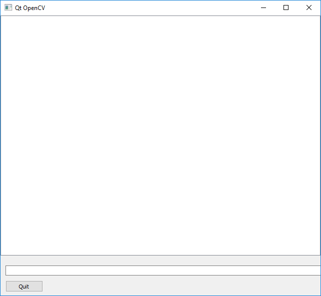

# Qt Tutorial 1: Creating a Simple Graphical User Interface

Welcome to my tutorial on how to create a simple Graphical User Interface (GUI).

## Introduction

You may be familiar with writing programs and running them in the console. You compile the source code, run the executable in the console, and your program's output is printed, line-by-line. Neat!

However, what if you want to output more than just text? A Graphical User Interface (GU) can be used to display images, allow for users to interact with your program, e.g. using buttons, and, it could be argued, a clearer way to present information. That's where Qt is useful.

In this tutorial I show you how to use Qt's C++ framework to create a simple GUI.

The tutorial is organised as follows: I first describe the requirements for completing this tutorial; then I list the tutorial's contents and describe how to build its activities and samples; next, I go through each sample's header and source files, describing each line's and snippet's purpose; I then prescribe activities for you to complete; and lastly, I conclude the tutorial.

## Requirements

### Windows

To build the source code listed in this tutorial, you need to have the following on your computer:

1. [Qt](https://www.qt.io/download)
1. [CMake](https://cmake.org/download/)
1. [Visual Studio IDE](https://visualstudio.microsoft.com/vs/)

If you haven't got these installed, click on each of the links to go to their respective download websites. Download and run the relevant system installer for your computer, e.g. CMake's "cmake-3.13.3-win64-x64.msi", and Microsoft's latest "Windows" installers for a 64-bit version of Visual Studio IDE for Windows 10. 

If you'd like to use an alternative Integrated Development Environment (IDE) to edit code, consider Microsoft's [Visual Studio Code](https://code.visualstudio.com/download). You'll find it a light-weight, and flexible, alternative to Visual Studio.

Once you've got Qt, CMake, and an IDE installed, you're ready to get started.

## How to Build the Tutorial's Samples and Activities

This tutorial contains the following files:

1. [sample_1/CMakeLists.txt](./sample_1/CMakeLists.txt)
1. [sample_1/main.hpp](./sample_1/main.hpp)
1. [sample_1/main.cpp](./sample_1/main.cpp)
1. [sample_1/gui.hpp](./smaple_1/gui.hpp)
1. [sample_1/gui.cpp](./smaple_1/gui.cpp)
1. [sample_1/data](./sample_1/data)
1. [README.md](./README.md)

Sample 1 contains source code that shows how to create a GUI. Activity 1 is a project set up for you to complete the tutorial's activity with.

### Windows

The following describe how to build the tutorial's sample and activity using either: console commands or Visual Studio IDE.

#### Console Commands

To build a Debug version of a sample or actvity, browse to its directory and use the following console commands:

````
mkdir build  
cd build  
cmake -G "Visual Studio 15 2017 Win64" ..  
cmake --build . --config Debug --target install 
````

To run the executable, browse to the sample's or actvity's 'bin' directory.

To build a Release version of a sample or activity, browse to its directory and use the following console commands:

````
mkdir build  
cd build  
cmake -G "Visual Studio 15 2017 Win64" ..  
cmake --build . --config Release --target install 
````

To run the executable, browse to the sample's or activity's 'bin' directory.

#### Visual Studio IDE

To build a Debug Version of a sample or activity:

1. Open Visual Studio IDE.
1. Click on 'File > Open > CMake'.
1. Browse to the sample's or activity's directory. 
1. Select 'CMakeLists.txt' and click on Open.
1. Click 'CMake > Build All'. 

To run the executable:

1. Click 'CMake > Debug from Build Folder > project'.

To change the build configuration:

1. Click 'CMake > Change CMake Settings > project'
1. Select the build configuration.

To build a 64-bit, debug application, select 'x64-Debug'. To build a 64-bit, release application, select 'x64-Release'. CMake's default is a x64-bit, debug configuration.

## Sample 1: Creating a simple GUI

Browse to the 'sample_1' directory.

Let's have a look at Sample 1's source code:

'main.hpp'
````cpp
#ifndef __MAIN_HPP__
#define __MAIN_HPP__

#include <QtWidgets/QApplication>

#include "gui.hpp"

#endif // !__MAIN_HPP__
````

'main.cpp'
````cpp
#include "main.hpp"

int main(int argc, char *argv[])
{
	QApplication a(argc, argv);

	gui w;

	QObject::connect(&w, SIGNAL(sig_quit()), &a, SLOT(quit()));

	w.show();

	return a.exec();
}
````

'gui.hpp'
````cpp
#ifndef __GUI_HPP__
#define __GUI_HPP__

#include <QtWidgets/QMainWindow>

#include <QGraphicsPixmapItem>
#include <QGraphicsScene>
#include <QGraphicsView>
#include <QLineEdit>
#include <QPushButton>

class gui : public QMainWindow
{
	Q_OBJECT

public:
	gui(QWidget *parent = Q_NULLPTR);

private:

	QGraphicsPixmapItem *graphicsPixmap;
	QGraphicsScene *graphicsScene;
	QGraphicsView *graphicsView;

	QLineEdit *debugLine;

	QPushButton *quitButton;
	
public slots:

	void slot_updateView(const QImage&);

	void slot_updateMessage(const QString&);

private slots:

	void slot_quit();

signals:

	void sig_quit();

};


#endif // !__GUI_HPP__
````

'gui.cpp'
````cpp
#include "gui.hpp"

gui::gui(QWidget *parent)
	: QMainWindow(parent)
{

	this->setGeometry(QRect(100, 100, 640, 560));
	this->setWindowTitle("Qt GUI");

	graphicsPixmap = new QGraphicsPixmapItem();

	graphicsScene = new QGraphicsScene(this);
	graphicsScene->addItem(graphicsPixmap);
	
	graphicsView = new QGraphicsView(this);
	graphicsView->setGeometry(QRect(0, 0, 640, 480));
	graphicsView->setHorizontalScrollBarPolicy(Qt::ScrollBarAlwaysOff);
	graphicsView->setVerticalScrollBarPolicy(Qt::ScrollBarAlwaysOff);
	graphicsView->setScene(graphicsScene);

	debugLine = new QLineEdit(this);
	debugLine->setGeometry(10, 500, 640, 20);
	debugLine->setText("");

	quitButton = new QPushButton(this);
	quitButton->setGeometry(10, 530, 75, 23);
	quitButton->setText("Quit");
	
	QObject::connect(quitButton, SIGNAL(clicked()), this, SLOT(slot_quit()));

	return;
	
}

void gui::slot_updateView(const QImage &image) {

	QPixmap pixmap = QPixmap::fromImage(image);

	graphicsPixmap->setPixmap(pixmap);

	return;
}

void gui::slot_updateMessage(const QString &message) {

	debugLine->setText(message);

	emit sig_messageUpdated();

	return;
}

void gui::slot_quit() {

	emit sig_quit();

	return;
}
````

Let's first consider 'main.hpp'. I have used a header guard to prevent including a header file more than once. Header guards are conditional directives that take the form:

````cpp
#ifndef __NAME__
#define __NAME__
    // declarations and definitions go here.
#endif __NAME__ //__NAME__
````

When 'main.hpp' is included, the first thing it does is check if `__MAIN_HPP__` has been defined. If it hasn't been, it defines `__MAIN_HPP__` and includes a header file. If it has, the entire header is ignored. For more information about header guards, see [[here](https://www.learncpp.com/cpp-tutorial/1-10a-header-guards/)].

I have included the `gui.hpp` header file, which provides access to the GUI's source code.

Next, let's consider 'main.cpp'. I have included the `main.hpp`, which gives access to the GUI. 

Let's now go through the 'main.cpp' block by block:

The line
````cpp
int main(int argc, char* argv[])
````
defines the program's entry point and has two parameters: `int argc` and `char* argv[]`. `argc` contains an integer number of command-line arguments, and `argv` contains a string of command-line arguments.

The line
````cpp
QApplication a(argc, argv);
````
defines the variable `a`, an instance of the `QApplication` class, which is initialised using the program's `argc` and `argv` parameters. The `QApplication` class manages the GUI application's control flow and main settings. For more information about the `QApplication` class, see [[here](https://doc.qt.io/qt-5/qapplication.html)].

The line
````cpp
gui w;
````
defines the variable `w`, an instance of the `gui` class.

The line
````cpp
QObject::connect(&w, SIGNAL(sig_quit()), &a, SLOT(quit()));
````
uses the `QObject` class's `connect()` member function to connect `w`'s `sig_quit()` signal to `a`'s `quit()` slot. When a user clicks the Quit button in the GUI, the `sig_quit()` signal will be generated and the application will exit. The `QObject` class is the base class of all Qt objects. For more information about the `QObject` class, see [[here](https://doc.qt.io/qt-5/qobject.html)].

The line
````cpp
w.show();
````
call's `w`'s inherited `QMainWindow` class's `show()` member function, which displays the GUI and its child widgets. For more information about the `QMainWindow` class, see [[here](https://doc.qt.io/qt-5/qmainwindow.html)].

The line
````cpp
return a.exec();
````
uses the `QApplication`'s `exec()` member function to enter the main event loop and wait until `exit()` is called. When it is, then the function returns the value it was set to; here, if it was called via `quit()`, it will return 0.

Next, let's consider 'gui.hpp'.

The block
````cpp
#ifndef __GUI_HPP__
#define __GUI_HPP__
````
declares a header guard. Here, the header guard checks to see if 'gui.hpp' has been included already.

The block
````cpp
#include <QGraphicsPixmapItem>
#include <QGraphicsScene>
#include <QGraphicsView>
#include <QLineEdit>
#include <QPushButton>
#include <QtWidgets/QMainWindow>
````
includes all the headers of the widgets used in the GUI. In the GUI, an instance of the `QGraphicsPixmapItem` class is added to an instance of the `QGraphicsScene` class, which in turn is rendered in an instance of the `QGraphicsView` class. An instance of `QLineEdit` is used to display a text string to the user. An instance of the `QPushButton` class is used by the user to indicate they want to exit the application.

The block
````cpp
class gui : public QMainWindow
{
	Q_OBJECT

    ...
}
````
defines the `gui` class, which inherits the `QMainWindow` parent class's member functions. Here, the `Q_OBJECT` Qt macro is used to tell the compiler that the class uses Qt's signals and slots mechanisms.

The block
````cpp
public:

	gui(QWidget *parent = Q_NULLPTR);
````
declares the class's public constructor.

The block
````cpp
private:

	QGraphicsPixmapItem *graphicsPixmap;
	QGraphicsScene *graphicsScene;
	QGraphicsView *graphicsView;

	QLineEdit *debugLine;

	QPushButton *quitButton;
````
declares the class's widgets. For more information about the `QGraphicsPixmapItem`, see [[here](https://doc.qt.io/qt-5/qgraphicspixmapitem.html#details)]. For more information about the `QGraphicsScene` class, see [[here](https://doc.qt.io/qt-5/qgraphicsscene.html)]. For more information about the `QGraphicsView` class, see [[here](https://doc.qt.io/qt-5/qgraphicsview.html)]. For more information about the `QLineEdit` class, see [[here](https://doc.qt.io/qt-5/qlineedit.html)]. For more information about the `QPushButton` class, see [[here](https://doc.qt.io/qt-5/qpushbutton.html)].

The block
````cpp
public slots:

	void slot_updateView(const QImage&);

	void slot_updateMessage(const QString&);
````
declares the class's public slots. Here, `slot_updateView()` is used to update `graphicsPixmap`, which in turn is rendered in the GUI; `slot_updateMessage()` is used to update `debugLine`, which in turn is displayed in the GUI.

The block
````cpp
private slots:

	void slot_quit();
````
declares the class's private slot. Here, `slot_quit()` is used by the class to exit 'cleanly', e.g. releasing objects held in memory, or stopping a thread from running before a program exits. `slot_quit()` emits the class's public `sig_quit()` signal.

The block
````cpp
signals:

	void sig_messageUpdated();

	void sig_quit();

}
````
declares the class's signals. Here, `sig_messageUpdated()` indicates the GUI's debug line has updated; `sig_quit()` indicates the user has clicked on the Quit button.

The line
````cpp
#endif //__GUI_HPP__
````
ends the previously declared header guard.

Lastly, let's consider 'gui.cpp'.

The line
````cpp
#include "gui.hpp"
````
provides access to the declared `gui` class.

The block
````cpp
gui::gui(QWidget *parent)
	: QMainWindow(parent)
{
````
defines the `gui` class's public constructor. 

The block
````cpp
    this->setGeometry(QRect(100, 100, 640, 560));
	this->setWindowTitle("Qt GUI");
````
Here, the function first sets the GUI's size to 640 x 560 pixels, with the top-left corner at point (100, 100), and sets the GUI's title to "Qt GUI".

The block
````cpp
	graphicsPixmap = new QGraphicsPixmapItem();
````
Next, the `graphicsPixmap` variable is allocated storage and constructed.

The block
````cpp
	graphicsScene = new QGraphicsScene(this);
	graphicsScene->addItem(graphicsPixmap);
````
Next, the `graphicsScene` variable is allocated storage and constructed, and the `graphicsPixmap` added to the scene.

The block
````cpp
	graphicsView = new QGraphicsView(this);
	graphicsView->setGeometry(QRect(0, 0, 640, 480));
	graphicsView->setHorizontalScrollBarPolicy(Qt::ScrollBarAlwaysOff);
	graphicsView->setVerticalScrollBarPolicy(Qt::ScrollBarAlwaysOff);
	graphicsView->setScene(graphicsScene);
````
Next, the variable `graphicsView` variable is allocated storage and constructed, its size set to 640 x 480 pixels, its scroll-bars disabled, and `graphicsScene` added to the view.

The block
````cpp
    debugLine = new QLineEdit(this);
	debugLine->setGeometry(10, 500, 640, 20);
	debugLine->setText("");
````
Next, the `debugLine` variable is allocated storage and constructed, its size set to 640 x 20, with the top-left corner at point (10, 500), and its text set to "".
	
The block
````cpp
    quitButton = new QPushButton(this);
	quitButton->setGeometry(10, 530, 75, 23);
	quitButton->setText("Quit");
````
Next, the `quitButton` variable is allocated storage and constructed, its size set to 75 x 23 pixels, with the top-left corder at point (10, 530), and its text set to "Quit".

The block
````cpp
	QObject::connect(quitButton, SIGNAL(clicked()), this, SLOT(slot_quit()));

	return;
	
}
````
Next, the class's `quitButton`'s `clicked()` signal is connected to the class's private `slot_quit()`. Lastly, the member function returns `null`.

The block
````cpp
void gui::slot_updateView(const QImage &image) {

	QPixmap pixmap = QPixmap::fromImage(image);

	graphicsPixmap->setPixmap(pixmap);

	return;
}
````
defines the `gui` class's `slot_updateView()` slot. Here, the variable `pixmap` is first defined as an instance of the `QPixmap` class and initialised using the `fromImage()` member function. Next, the class's `graphicsPixmap` is then set to `pixmap`. Lastly, the slot returns `null`.

The block
````cpp
void gui::slot_updateMessage(const QString &message) {

	debugLine->setText(message);

	emit sig_messageUpdated();

	return;
}
````
defines the `gui` class's `slot_updateMessage()` slot. Here, it first updates the class's `debugLine`'s text. Next, it emits the `sig_messageUpdated()`. Lastly, it returns `null`.

The block
````cpp
void gui::slot_quit() {

	emit sig_quit();

	return;
}
````
defines the `gui` class's `slot_quit()` slot. Here, it first emits the class's `sig_quit()` signal. Lastly, it returns `null`.

Now that we've looked at the sample's source code, let's build and run its executable.

You should see the following image be displayed:

<!--  -->
<style>
img {
	display: block;
	margin-left: auto;
	margin-right: auto;
	width: 50%;
}
</style>

<div id="image">
	
</div>

## Actvity 1: Create Your on Simple GUI

Browse to the 'activity_1' directory.

Now that you know how to create a simple GUI, complete the following activities:

1. Use a Qt function to change the activity's GUI's title to "Your Name's GUI". Substitute Your Name, with your name.
1. Use a Qt function to change the activitiy's GUI's size to 1024 x 720 pixels.
1. Use a Qt function to add two buttons to the activity's GUI: 1) 'Okay', and 2) 'Quit'.
1. Use the Qt framework's signals and slot mechanisms so that when a user clicks on 'Okay', the GUI's title becomes: 'OK'; when the user clicks on 'Quit', the application closes.

Once you've completed these, build the activity's source code and run it's executable.

Take a screen shot of the displayed window.

## Conclusion

In this tutorial I've shown you how to create a simple GUI using Qt's C++ framework. 

You've used Qt's `QApplication` to handle events, created an instance of `QMainWindow`, populated it with widgets, and connected a class's signals to the main application's slots.

I hope this tutorial has been helpful.

## Credit

Dr Frazer K. Noble  
Department of Mechanical and Electrical Engineering   
School of Food and Advanced Technology  
Massey University  
New Zealand 

<a href="https://twitter.com/drfrazernoble" class="twitter-follow-button" data-show-count="false">@DrFrazerNoble</a><script async src="https://platform.twitter.com/widgets.js" charset="utf-8"></script>