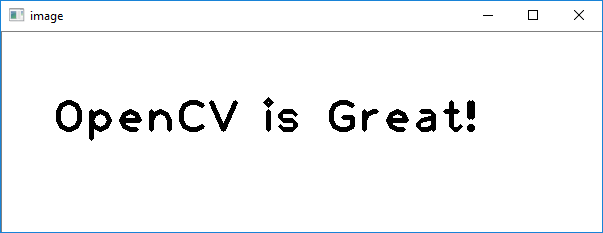

# OpenCV Tutorial 3: Drawing Lines and Text on an Image

Welcome to my tutorial on how to draw lines and text on an image using OpenCV.

## Introduction

OpenCV's `imread()` and `imwrite()` allows for loading and saving images; now you're able to use images in your programs. Neat!

However, what if you want to do more than read and write images. What if you want to create a "dank" meme for the "lolz"? OpenCV can help with that too!

In this tutorial, I show you how to use OpenCV's C++ library to draw lines and text on an image.

The tutorial is organised as follows: I first describe the requirements for completing this tutorial; then I list the tutorial's contents and describe how to build its activities and samples; next, I go through each sample's header and source files, describing each line's and snippet's purpose; I then prescribe activities for you to complete; and lastly, I conclude the tutorial.

## Requirements

### Windows

To build the source code listed in this tutorial, you need to have the following on your computer:

1. [CMake](https://cmake.org/download/)
2. [OpenCV](https://opencv.org/releases.html)
3. [Visual Studio](https://visualstudio.microsoft.com/vs/)

If you haven't got these installed, click on each of the links to go to their respective download websites. Download and run the relevant system installer for your computer, e.g. CMake's "cmake-3.13.3-win64-x64.msi", OpenCV's 4.0.1 "Win pack", and Microsoft's latest "Windows" installers for a 64-bit version of Windows 10. 

If you'd like to use an alternative Integrated Development Environment (IDE) to edit code, consider Microsoft's [Visual Studio Code](https://code.visualstudio.com/download). You'll find it a light-weight, and flexible, alternative to Visual Studio.

Once you've got CMake, OpenCV, and an IDE installed, you're ready to get started.

## How to Build the Tutorial's Samples and Activities

This tutorial contains the following files:

1. [activity_1/CMakeLists.txt](./activity_1/CMakeLists.txt)
1. [activity_1/main.hpp](./activity_1/main.hpp)
1. [activity_1/main.cpp](./activity_1/main.cpp)
1. [activity_2/CMakeLists.txt](./activity_2/CMakeLists.txt)
1. [activity_2/data/image.jpg](./activity_2/data/image.jpg)
1. [activity_2/main.hpp](./activity_2/main.hpp)
1. [activity_2/main.cpp](./activity_2/main.cpp)
1. [sample_1/CMakeLists.txt](./sample_1/CMakeLists.txt)
1. [sample_1/main.hpp](./sample_1/main.hpp)
1. [sample_1/main.cpp](./sample_1/main.cpp)
1. [sample_2/CMakeLists.txt](./sample_2/CMakeLists.txt)
1. [sample_2/main.hpp](./sample_2/main.hpp)
1. [sample_2/main.cpp](./sample_2/main.cpp)
1. [README.md](./README.md)

Sample 1 contains source code that shows how to draw lines on an image. Sample 2 shows how to draw text on an image. Activity 1 and Activity 2 are projects set up for you to complete the tutorial's activities with. Activity 2's 'data' sub-directory contains an input file.

### Windows

The following describe how to build the tutorial's sample and activity using either: console commands or Visual Studio IDE.

#### Console Commands

To build a Debug version of a sample or actvity, browse to its directory and use the following console commands:

````
mkdir build  
cd build  
cmake -G "Visual Studio 15 2017 Win64" ..  
cmake --build . --config Debug --target install 
````

To run the executable, browse to the sample's or actvity's 'bin' directory.

To build a Release version of a sample or activity, browse to its directory and use the following console commands:

````
mkdir build  
cd build  
cmake -G "Visual Studio 15 2017 Win64" ..  
cmake --build . --config Release --target install 
````

To run the executable, browse to the sample's or activity's 'bin' directory.

#### Visual Studio IDE

To build a Debug Version of a sample or activity:

1. Open Visual Studio IDE.
1. Click on 'File > Open > CMake'.
1. Browse to the sample's or activity's directory. 
1. Select 'CMakeLists.txt' and click on Open.
1. Click 'CMake > Build All'. 

To run the executable:

1. Click 'CMake > Debug from Build Folder > project'.

To change the build configuration:

1. Click 'CMake > Change CMake Settings > project'
1. Select the build configuration.

To build a 64-bit, debug application, select 'x64-Debug'. To build a 64-bit, release application, select 'x64-Release'. CMake's default is a x64-bit, debug configuration.

## Sample 1: Drawing Lines on an Image

Browse to the 'sample_1' directory.

Let's have a look at Sample 1's source code:

'main.hpp'
````cpp
#ifndef __MAIN_HPP__
#define __MAIN_HPP__

#include <opencv2/opencv.hpp>

#endif //__MAIN_HPP__
````

'main.cpp'
````cpp
#include "main.hpp"

namespace fs = std::experimental::filesystem;

int main(int argc, char* argv[]) {

	cv::Mat image = cv::Mat(cv::Size(400, 400), CV_8UC3, cv::Scalar(255, 255, 255));

	cv::line(image, cv::Point(100, 50), cv::Point(300, 50), cv::Scalar(0, 0, 0), 10);
	cv::line(image, cv::Point(350, 100), cv::Point(350, 300), cv::Scalar(0, 0, 0), 10);
	cv::line(image, cv::Point(300, 350), cv::Point(100, 350), cv::Scalar(0, 0, 0), 10);
	cv::line(image, cv::Point(50, 300), cv::Point(50, 100), cv::Scalar(0, 0, 0), 10);

	cv::ellipse(image, cv::Point(100, 100), cv::Size(50, 50), 0, 180, 270, cv::Scalar(0, 0, 0), 10);
	cv::ellipse(image, cv::Point(300, 100), cv::Size(50, 50), 0, 270, 360, cv::Scalar(0, 0, 0), 10);
	cv::ellipse(image, cv::Point(100, 300), cv::Size(50, 50), 0, 90, 180, cv::Scalar(0, 0, 0), 10);
	cv::ellipse(image, cv::Point(300, 300), cv::Size(50, 50), 0, 0, 90, cv::Scalar(0, 0, 0), 10);

	cv::circle(image, cv::Point(200, 200), 75, cv::Scalar(0, 0, 0), 10);
	cv::circle(image, cv::Point(300, 100), 25, cv::Scalar(0, 0, 0), -1);

	cv::imshow("image", image);

	cv::waitKey(0);

	cv::destroyAllWindows();

    return 0;
}
````

Let's first consider 'main.hpp'. I have used a header guard to prevent including a header file more than once. Header guards are conditional directives that take the form:

````cpp
#ifndef __NAME__
#define __NAME__
    // declarations and definitions go here.
#endif __NAME__ //__NAME__
````

When 'main.hpp' is included, the first thing it does is check if `__MAIN_H__` has been defined. If it hasn't been, it defines `__MAIN_H__` and includes a header file. If it has been, the entire header is ignored. For information about header guards, see [[here](https://www.learncpp.com/cpp-tutorial/1-10a-header-guards/)].

I have included the `opencv2/opencv.hpp` header file, which provides access to a range of OpenCV's modules, e.g. core, imgproc, and highgui. For more information about the modules, see [[here](https://docs.opencv.org/4.0.1/)].

Next, let's consider 'main.cpp'. I have just included the `main` header file, which provides access to OpenCV's functions. 

Let's now go through the 'main.cpp' block by block:

The line:
````cpp
int main(int argc, char* argv[])
````
defines the program's entry point and has two parameters: `int argc` and `char* argv[]`. `argc` contains an integer number of command-line arguments, and `argv` contains a string of command-line arguments.

The line
````cpp
cv::Mat image = cv::Mat(cv::Size(400, 400), CV_8UC3, cv::Scalar(255, 255, 255));
````
defines the variable `image`, which is initialised using `image`'s overloaded `Mat()` member function. There are, to date, 29 different overloaded member functions available. Here, I've defined `image` as a 400 x 400 pixel (px), 8-bit, three channel image, whose pixels' colour is set by the Blue Green Red (BGR) scalar (255, 255, 255). For more information about the `Mat` class, see [[here](https://docs.opencv.org/4.0.1/dc/d84/group__core__basic.html)].

The snippet
````cpp
cv::line(image, cv::Point(100, 50), cv::Point(300, 50), cv::Scalar(0, 0, 0), 10);
cv::line(image, cv::Point(350, 100), cv::Point(350, 300), cv::Scalar(0, 0, 0), 10);
cv::line(image, cv::Point(300, 350), cv::Point(100, 350), cv::Scalar(0, 0, 0), 10);
cv::line(image, cv::Point(50, 300), cv::Point(50, 100), cv::Scalar(0, 0, 0), 10);
````
uses OpenCV's `line()` function to draw four lines on `image`. `line()` has eight parameters: `InputOutputArray img`, `Point 	pt1`, `Point pt2`, `const Scalar &color`, `int thickness`, `int lineType`, and `int shift`. `img` is the image to be drawn on, `pt1` is the line segment's first point , `pt2` is the line segment's second point, `color` is the line's colour, `thickness` is the line's thickness, `lineType` is the line's bounday type, and `shift` is the number of fractional bits in the point coordinates. For more information about `line()`, see [[here](https://docs.opencv.org/4.0.1/d6/d6e/group__imgproc__draw.html)].
  
The snippet
````cpp
cv::ellipse(image, cv::Point(100, 100), cv::Size(50, 50), 0, 180, 270, cv::Scalar(0, 0, 0), 10);
cv::ellipse(image, cv::Point(300, 100), cv::Size(50, 50), 0, 270, 360, cv::Scalar(0, 0, 0), 10);
cv::ellipse(image, cv::Point(100, 300), cv::Size(50, 50), 0, 90, 180, cv::Scalar(0, 0, 0), 10);
cv::ellipse(image, cv::Point(300, 300), cv::Size(50, 50), 0, 0, 90, cv::Scalar(0, 0, 0), 10);
````
uses OpenCV's `ellipse()` function to draw four ellipses on `image`. `ellipse()` has 10 parameters: `InputOutputArray img`, `Point center`, `Size axes`, `double angle`, `double startAngle`, `double endAngle`, `const Scalar &color`, `int thickness`, `int lineType`, and `int shift`. `image` is the image to be drawn on, `center` is the ellipse's centre, `axis` is half the ellipse's major axis, `angle` is the ellipse's rotation angle, `startAngle` is the ellipse's start angle, `endAngle` is the ellipse's end angle, `color` is the ellipse's line colour, `thickness` is the ellipse's line thickness, `lineType` is the ellipse's boundary type, and `shift` is the number of fractional bits in the coordinates of the center and values of axes. For more information about `ellipse()`, see [[here](https://docs.opencv.org/4.0.1/d6/d6e/group__imgproc__draw.html)].

The snippet
````cpp
cv::circle(image, cv::Point(200, 200), 75, cv::Scalar(0, 0, 0), 10);
cv::circle(image, cv::Point(300, 100), 25, cv::Scalar(0, 0, 0), -1);
````
use OpenCV's `circle()` function to draw two circles on `image`; the smaller of the two is filled in. `circle()` has eight parameters:  `InputOutputArray img`, `Point center`, `int radius`, `const Scalar &color`, `int thickness`, `int lineType`, and `int shift`. `img` is the image to be drawn on, `center` is the circle's centre, `radius` is the circle's radius, `color` is the circle's colour, `thickness` is the circle's line thickness, `lineType` is the circle's bondary type, and `shift` is the number of fractional bits in the coordinates of the center and in the radius value. For more information about `circle()`, see [[here](https://docs.opencv.org/4.0.1/d6/d6e/group__imgproc__draw.html)].

The line
````cpp
cv::imshow("image", image);
````
uses OpenCV's `imshow()` function to display `image` in a window. `imshow()` has two parameters: `const String &winname` and `InputArray mat`. `winname` is the name of the window and `mat` is the image to be shown. For more information about `imshow()`, see [[here](https://docs.opencv.org/4.0.1/d7/dfc/group__highgui.html)].

The line
````cpp
cv::waitKey(0)
````
uses OpenCV's `waitKey()` function to wait for a user to press a key. `waitKey()` has one parameter: `int delay`. `delay` is the delay in milliseconds the function waits; 0 means "forever". For more information about `waitKey()`, see [[here](https://docs.opencv.org/4.0.1/d7/dfc/group__highgui.html)] 

The line
````cpp
cv::destroyAllWindows();
````
uses OpenCV's `destroyAllWindows()` function to close all open highgui windows. `destroyAllWindows()` has no parameters. For more information about `destroyAllWindows()', see [[here](https://docs.opencv.org/4.0.1/d7/dfc/group__highgui.html)].

The line
````cpp
return 0;
````
terminates the program.

Now that we've looked at the sample's source code, let's build and run its executable.

You should see the following image be displayed:

<!--  -->
<style>
img {
	display: block;
	margin-left: auto;
	margin-right: auto;
	width: 50%;
}
</style>

<div id="image">
	
</div>

## Actvity 1: Drawing Lines your own Image

Browse to the 'activity_1' directory.

Now that you know how to draw using OpenCV, complete the following activities:

1. Use a header guard to include the OpenCV header file. 
1. Create a 640 x 480 px image with a white background.
1. Use OpenCV functions to draw your first vehicle. Bonus points if it was a spaceship, or had flames on it.
1. Use an OpenCV function to save the image to a 'data' sub-directory.
1. Use an OpenCV function to display the image.

Once you've completed these, build the activity's source code and run its executable.

Take a screen shot of the displayed window.

## Sample 2: Drawing Text on an Image

Browse to the 'sample_2' directory.

Let's have a look at Sample 2's source code:

'main.hpp'
````cpp
#ifndef __MAIN_HPP__
#define __MAIN_HPP__

#include <opencv2/opencv.hpp>

#endif //__MAIN_HPP__
````

'main.cpp'
````cpp
#include <iostream>

#include "main.hpp"

int main(int argc, char* argv[]) {

	cv::Mat image = cv::Mat(cv::Size(600, 200), CV_8UC3, cv::Scalar(255, 255, 255));

	cv::putText(image, "OpenCV is Great!", cv::Point(50,100), cv::FONT_HERSHEY_PLAIN, 3, cv::Scalar(0, 0, 0), 3);

	cv::imshow("image", image);

	cv::waitKey(0);

	cv::destroyAllWindows();

    return 0;
}
````

Let's first consider 'main.hpp'. I have used a header guard to prevent including a header file more than once. Header guards are conditional directives that take the form:

````cpp
#ifndef __NAME__
#define __NAME__
    // declarations and definitions go here.
#endif __NAME__ //__NAME__
````

When 'main.hpp' is included, the first thing it does is check if `__MAIN_H__` has been defined. If it hasn't been, it defines `__MAIN_H__` and includes a header file. If it has been, the entire header is ignored. For information about header guards, see [[here](https://www.learncpp.com/cpp-tutorial/1-10a-header-guards/)].

I have included the `opencv2/opencv.hpp` header file, which provides access to a range of OpenCV's modules, e.g. core, imgproc, and highgui. For more information about the modules, see [[here](https://docs.opencv.org/4.0.1/)].

Next, let's consider 'main.cpp'. I have just included the `main` header file, which provides access to OpenCV's functions. 

Let's now go through the 'main.cpp' block by block:

The line
````cpp
int main(int argc, char* argv[])
````
defines the program's entry point and has two parameters: `int argc` and `char* argv[]`. `argc` contains an integer number of command-line arguments, and `argv` contains a string of command-line arguments.

The line
````cpp
cv::Mat image = cv::Mat(cv::Size(600, 200), CV_8UC3, cv::Scalar(255, 255, 255));
````
defines the variable `image`, which is initialised using an `image`'s overloaded `Mat()` member function. There are, to date, 29 different overloaded member functions available. Here, I've defined `image` as a 600 x 200 pixel (px), 8-bit, three channel image, whose pixels' colour is set by the Blue Green Red (BGR) scalar (255, 255, 255). For more information about the `Mat` class, see [[here](https://docs.opencv.org/4.0.1/dc/d84/group__core__basic.html)].

The line
````cpp
cv::putText(image, "OpenCV is Great!", cv::Point(50,100), cv::FONT_HERSHEY_PLAIN, 3, cv::Scalar(0, 0, 0), 3);
````
uses OpenCV's `putText()` function to add text to `image`. `putText()` has nine parameters: `InputOutputArray img`, `const String &text`, `Point org`, `int fontFace`, `double	fontScale`, `Scalar color`, `int thickness`, `int lineType`, and `bool 	bottomLeftOrigin`. `img` is the image to be drawn on, `text` is the string of text to be drawn, `org` is the text's bottom-left corner, `fontFace` is the text's font type, `fontScale` is the scale factor the font base size is multiplied by, `color` is the text's colour, `thickness` is the text's thickness, `lineType` is the text's boundary type, and `bottomLeftOrigin` sets whether the bottom-left corner is the origin; else, it's the top-left corner. For more information about `putText()`, see [[here](https://docs.opencv.org/4.0.1/d6/d6e/group__imgproc__draw.html)].

The line
````cpp
cv::imshow("image", image);
````
uses OpenCV's `imshow()` function to display `image` in a window. `imshow()` has two parameters: `const String &winname` and `InputArray mat`. `winname` is the name of the window and `mat` is the image to be shown. For more information about `imshow()`, see [[here](https://docs.opencv.org/4.0.1/d7/dfc/group__highgui.html)].

The line
````cpp
cv::waitKey(0)
````
uses OpenCV's `waitKey()` function to wait for a user to press a key. `waitKey()` has one parameter: `int delay`. `delay` is the delay in milliseconds the function waits; 0 means "forever". For more information about `waitKey()`, see [[here](https://docs.opencv.org/4.0.1/d7/dfc/group__highgui.html)] 

The line
````cpp
cv::destroyAllWindows();
````
uses OpenCV's `destroyAllWindows()` function to close all open highgui windows. `destroyAllWindows()` has no parameters. For more information about `destroyAllWindows()', see [[here](https://docs.opencv.org/4.0.1/d7/dfc/group__highgui.html)].

The line
````cpp
return 0;
````
terminates the program.

Now that we've looked at the sample's source code, let's build and run its executable.

You should see the following image be displayed:

<!--  -->
<div id="image">
	
</div>

## Activity 2: Drawing Text on your own Image

Browse to the 'activity_1' directory.

Now that you know how to draw using OpenCV, complete the following activities:

1. Use a header guard to include the OpenCV header file. 
1. Use an OpenCV function to load 'image.png' from Activity 2's 'data' sub-directory.
1. Use an OpenCV function to add the following text to the image: "I don't always make memes, but when I do, I use OpenCV".
1. Use an OpenCV function to save the image to a 'data' sub-directory.
1. Use an OpenCV function to display the image.

Once you've completed these, build the activity's source code and run its executable.

Take a screen shot of the displayed window.

## Conclusion

In this tutorial I've shown you how to use OpenCV's C++ library to draw lines and text on an image.

You've used OpenCV's `ellipse()`, `line()`, `circle()`, and `putText()` functions to draw ellipses, lines, circles, and text on an images. You've even made a "dank" meme (I hope you get a lot of "lolz").

I hope this tutorial has been helpful.

## Credit

Dr Frazer K. Noble  
Department of Mechanical and Electrical Engineering   
School of Food and Advanced Technology  
Massey University  
New Zealand 

<a href="https://twitter.com/drfrazernoble" class="twitter-follow-button" data-show-count="false">@DrFrazerNoble</a><script async src="https://platform.twitter.com/widgets.js" charset="utf-8"></script>