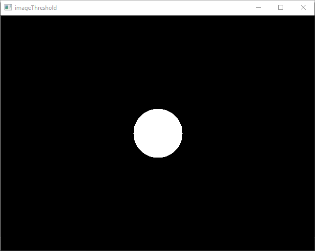

# OpenCV Tutorial 4: Thresholding an Image

Welcome to my tutorial on how to threshold an image using OpenCV.

## Introduction

You may be familiar with loading and saving images, accessing an image's pixels, and drawing primitive shapes on an image. However, what if you want to segment part of an image, e.g. find some black text on a white background? OpenCV has a number of thresholding functions that can help do that.

In this tutorial I show you how to use OpenCV's C++ library to threshold an image.

This tutorial is organised as follows: I first describe the requirements for completing this tutorial; then I list the tutorial's contents and describe how to build its activity and sample; next, I go through the sample's header and source files, describing each line's and snippet's purpose; I then prescribe activities for you to complete;
and lastly, I conclude the tutorial.

## Requirements

### Windows

To build the source code listed in this tutorial, you need to have the following on your computer:

1. [CMake](https://cmake.org/download/)
2. [OpenCV](https://opencv.org/releases.html)
3. [Visual Studio](https://visualstudio.microsoft.com/vs/)

If you haven't got these installed, click on each of the links to go to their respective download websites. Download and run the relevant system installer for your computer, e.g. CMake's "cmake-3.13.3-win64-x64.msi", OpenCV's 4.0.1 "Win pack", and Microsoft's latest "Windows" installers for a 64-bit version of Windows 10. 

If you'd like to use an alternative Integrated Development Environment (IDE) to edit code, consider Microsoft's [Visual Studio Code](https://code.visualstudio.com/download). You'll find it a light-weight, and flexible, alternative to Visual Studio.

Once you've got CMake, OpenCV, and an IDE installed, you're ready to get started.

## How to Build the Tutorial's Samples and Activities

This tutorial contains the following files:

1. [activity_1/CMakeLists.txt](./activity_1/CMakeLists.txt)
1. [activity_1/main.hpp](./activity_1/main.hpp)
1. [activity_1/main.cpp](./activity_1/main.cpp)
1. [sample_1/CMakeLists.txt](./sample_1/CMakeLists.txt)
1. [sample_1/main.hpp](./sample_1/main.hpp)
1. [sample_1/main.cpp](./sample_1/main.cpp)
1. [README.md](./README.md)

Sample 1 contains source code that shows how to threshold an image. Activity 1 is a project set up for you to complete the tutorial's activities with.

### Windows

The following describe how to build the tutorial's sample and activity using either: console commands or Visual Studio IDE.

#### Console Commands

To build a Debug version of a sample or actvity, browse to its directory and use the following console commands:

````
mkdir build  
cd build  
cmake -G "Visual Studio 15 2017 Win64" ..  
cmake --build . --config Debug --target install 
````

To run the executable, browse to the sample's or actvity's 'bin' directory.

To build a Release version of a sample or activity, browse to its directory and use the following console commands:

````
mkdir build  
cd build  
cmake -G "Visual Studio 15 2017 Win64" ..  
cmake --build . --config Release --target install 
````

To run the executable, browse to the sample's or activity's 'bin' directory.

#### Visual Studio IDE

To build a Debug Version of a sample or activity:

1. Open Visual Studio IDE.
1. Click on 'File > Open > CMake'.
1. Browse to the sample's or activity's directory. 
1. Select 'CMakeLists.txt' and click on Open.
1. Click 'CMake > Build All'. 

To run the executable:

1. Click 'CMake > Debug from Build Folder > project'.

To change the build configuration:

1. Click 'CMake > Change CMake Settings > project'
1. Select the build configuration.

To build a 64-bit, debug application, select 'x64-Debug'. To build a 64-bit, release application, select 'x64-Release'. CMake's default is a x64-bit, debug configuration.

## Sample 1: Thresholding an Image

Browse to the 'sample_1' directory.

Let's have a look at Sample 1's source code:

'main.hpp'
````cpp
#ifndef __MAIN_H__
#define __MAIN_H__

#include <opencv2/opencv.hpp>

#endif //__MAIN_H__
````

'main.cpp'
````cpp
#include "main.hpp"

int main(int argc, char* argv[]) {

    cv::Mat image{ cv::Mat(cv::Size(640, 480), CV_8UC1, cv::Scalar(0)) };

    cv::circle(image, cv::Point(320, 240), 50, cv::Scalar(125), -1);

    cv::imshow("image", image);

    cv::waitKey(1);

    cv::Mat imageThreshold;

    cv::threshold(image, imageThreshold, 124, 255, cv::THRESH_BINARY);

    cv::imshow("imageThreshold", imageThreshold);

    cv::waitKey(0);

    cv::destroyAllWindows();

    return 0;
    
}
````

Let's first consider 'main.hpp'. I have used a header guard to prevent including a header file more than once. Header guards are conditional directives that take the form:

````cpp
#ifndef __NAME__
#define __NAME__
    // declarations and definitions go here.
#endif __NAME__ //__NAME__
````

When 'main.hpp' is included, the first thing it does is check if `__MAIN_H__` has been defined. If it hasn't been, it defines `__MAIN_H__` and includes a header file. If it has been, the entire header is ignored. For information about header guards, see [[here](https://www.learncpp.com/cpp-tutorial/1-10a-header-guards/)].

I have included the `opencv2/opencv.hpp` header file, which provides access to a range of OpenCV's modules, e.g. core, imgproc, and highgui. For more information about the modules, see [[here](https://docs.opencv.org/4.0.1/)].

Next, let's consider 'main.cpp'. I have just included the `main` header file, which provides access to OpenCV's functions. 

Let's now go through the 'main.cpp' block by block:

The line:
````cpp
int main(int argc, char* argv[])
````
defines the program's entry point and has two parameters: `int argc` and `char* argv[]`. `argc` contains an integer number of command-line arguments, and `argv` contains a string of command-line arguments.

The line
````cpp
cv::Mat image = cv::Mat(cv::Size(640, 480), CV_8UC1, cv::Scalar(0));
````
defines the variable `image`, which is initialised using `image`'s overloaded `Mat()` member function. There are, to date, 29 different overloaded member functions available. Here, I've defined `image` as a 640 x 480 pixel (px), 8-bit, one channel image, whose pixels' colour is set by the grayscale scalar (0). For more information about the `Mat` class, see [[here](https://docs.opencv.org/4.0.1/dc/d84/group__core__basic.html)].

The line
````cpp
cv::circle(image, cv::Point(320, 240), 50, cv::Scalar(125), -1);
````
use OpenCV's `circle()` function to draw a circle on `image`, which is filled in. `circle()` has eight parameters:  `InputOutputArray img`, `Point center`, `int radius`, `const Scalar &color`, `int thickness`, `int lineType`, and `int shift`. `img` is the image to be drawn on, `center` is the circle's centre, `radius` is the circle's radius, `color` is the circle's colour, `thickness` is the circle's line thickness, `lineType` is the circle's bondary type, and `shift` is the number of fractional bits in the coordinates of the center and in the radius value. For more information about `circle()`, see [[here](https://docs.opencv.org/4.0.1/d6/d6e/group__imgproc__draw.html)].

The line
````cpp
cv::imshow("image", image);
````
uses OpenCV's `imshow()` function to display `image` in a window. `imshow()` has two parameters: `const String &winname` and `InputArray mat`. `winname` is the name of the window and `mat` is the image to be shown. For more information about `imshow()`, see [[here](https://docs.opencv.org/4.0.1/d7/dfc/group__highgui.html)].

The line
````cpp
cv::waitKey(1)
````
uses OpenCV's `waitKey()` function to wait for a user to press a key. `waitKey()` has one parameter: `int delay`. `delay` is the delay in milliseconds the function waits. Here, we instruct the window to wait for one millisecond, which is necessary for `image` to be displayed (without calling `waitKey()`, the window will only display a gray panel). For more information about `waitKey()`, see [[here](https://docs.opencv.org/4.0.1/d7/dfc/group__highgui.html)] 

The line
````cpp
cv::Mat imageThreshold;
````
declares the variable `imageThreshold`.

The line
````cpp
cv::threshold(image, imageThreshold, 124, 255, cv::THRESH_BINARY);
````
uses OpenCV's `threshold()` function to segment regions of `image` that are within the bounds of a threshold. `threshold()` has five parameters: `InputArray	src`, `OutputArray dst`, `double thresh`, `double maxval`, and `int type`. `src` is the input image, `dst` is the thresholded image, `thresh` is the threshold value, `maxval` is the maximum value to use for binary-based thresholding methods, and `type` is the thresholding type. Here, I have applied a binary threshold to `image`. `imageThreshold` will be a binary image; where, white pixels correlate to `image`'s pixels greater than the threshold and black pixels otherwise. For more information about `threshold()` and thresholding types, see [[here](https://docs.opencv.org/4.0.1/d7/d1b/group__imgproc__misc.htm)].  

The line
````cpp
cv::imshow("image", image);
````
uses OpenCV's `imshow()` function to display `image` in a window.

The line
````cpp
cv::waitKey(0)
````
uses OpenCV's `waitKey()` function to wait for a user to press a key.

The line
````cpp
cv::destroyAllWindows();
````
uses OpenCV's `destroyAllWindows()` function to close all open highgui windows. `destroyAllWindows()` has no parameters. For more information about `destroyAllWindows()', see [[here](https://docs.opencv.org/4.0.1/d7/dfc/group__highgui.html)].

The line
````cpp
return 0;
````
terminates the program.

Now that we've looked at the sample's source code, let's build and run its executable.

You should see the following images displayed:

<!--  -->
<style>
img {
	display: block;
	margin-left: auto;
	margin-right: auto;
	width: 50%;
}
</style>

<div id="image">
	
</div>

<!--  -->
<div id="image">
	
</div>

## Actvity 1: Thresholding Your Own Image

Browse to the 'activity_1' directory.

Now that you know how to draw using OpenCV, complete the following activities:

1. Use a header guard to include the OpenCV header file. 
1. Create a 640 x 480 px image with a white background.
1. Use OpenCV functions to draw a black circle with a radius of 25 px at point [250, 50].
1. Use an OpenCV function to apply an inverse binary threshold.
1. Use an OpenCV function to display the image.

Once you've completed these, build the activity's source code and run its executable.

Take a screen shot of the displayed window.

## Conclusion

In this tutorial I have shown you how to use OpenCV's C++ library to threshold an image.

You've used OpenCV's `threshold()` function, along with different thresholding types, to segment an image.

I hope this tutorial has been helpful.

## Credit

Dr Frazer K. Noble  
Department of Mechanical and Electrical Engineering   
School of Food and Advanced Technology  
Massey University  
New Zealand 

<a href="https://twitter.com/drfrazernoble" class="twitter-follow-button" data-show-count="false">@DrFrazerNoble</a><script async src="https://platform.twitter.com/widgets.js" charset="utf-8"></script>