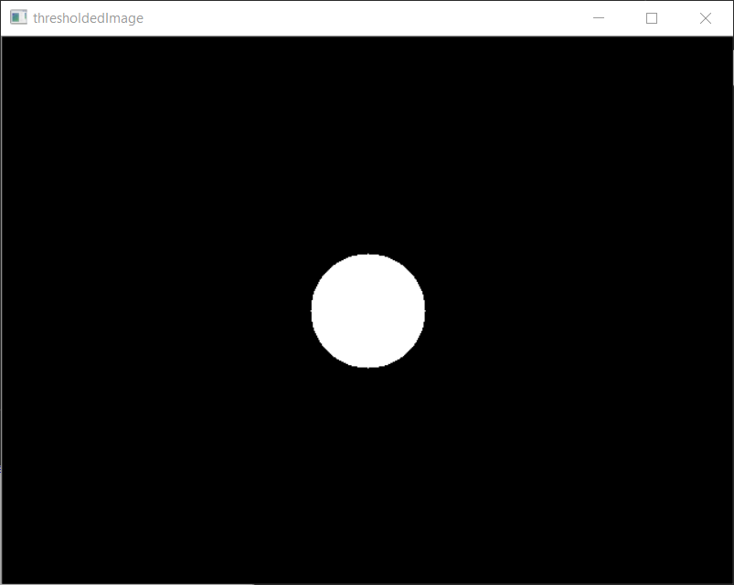
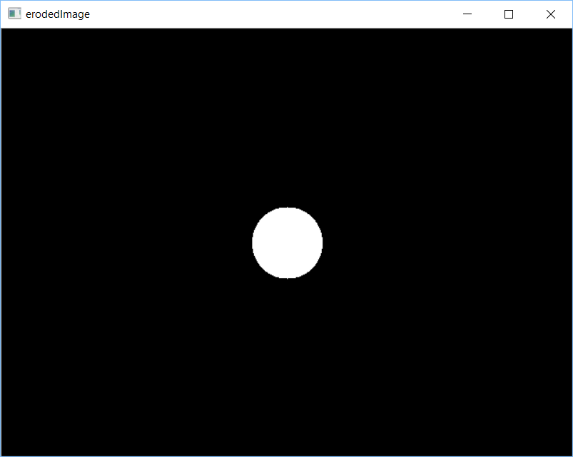
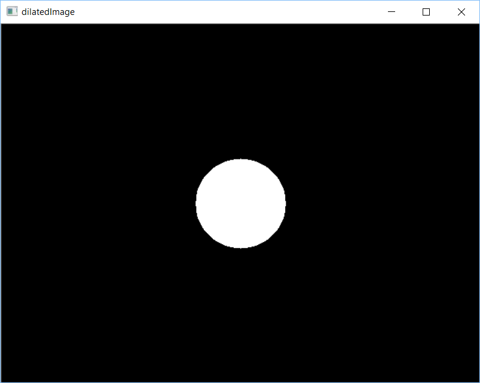

# OpenCV Tutorial 5: Applying Morphological Operations to an Image

Welcome to my tutorial on how to apply morphological operations to an image using OpenCV.

## Introduction

You may be familiar with thresholding an image: you load an image, apply a thresholding function, and display the results. However, what if you don't define your thresholding range correctly, e.g. if you're trying to detect a red apple, but only set the thresholding range to find orange? What will happen is you'll get an image with black and white patches. You can fix this by making the white patches bigger, dilating the black regions, until you end up with a solid, white segment. OpenCV has a number of morphological operations that can help do this.

In this tutorial I show you how to use OpenCV's C++ library to erode and dilate an image.

This tutorial is organised as follows: I first describe the requirements for completing this tutorial; then I list the
tutorial's contents and describe how to build its activity and sample; next, I go through the sample's header
and source files, describing each line's and snippet's purpose; I then prescribe activities for you to complete;
and lastly, I conclude the tutorial.

## Requirements

### Windows

To build the source code listed in this tutorial, you need to have the following on your computer:

1. [CMake](https://cmake.org/download/)
2. [OpenCV](https://opencv.org/releases.html)
3. [Visual Studio](https://visualstudio.microsoft.com/vs/)

If you haven't got these installed, click on each of the links to go to their respective download websites. Download and run the relevant system installer for your computer, e.g. CMake's "cmake-3.13.3-win64-x64.msi", OpenCV's 4.0.1 "Win pack", and Microsoft's latest "Windows" installers for a 64-bit version of Windows 10. 

If you'd like to use an alternative Integrated Development Environment (IDE) to edit code, consider Microsoft's [Visual Studio Code](https://code.visualstudio.com/download). You'll find it a light-weight, and flexible, alternative to Visual Studio.

Once you've got CMake, OpenCV, and an IDE installed, you're ready to get started.

## How to Build the Tutorial's Samples and Activities

This tutorial contains the following files:

1. [activity_1/CMakeLists.txt](./activity_1/CMakeLists.txt)
1. [activity_1/main.hpp](./activity_1/main.hpp)
1. [activity_1/main.cpp](./activity_1/main.cpp)
1. [sample_1/CMakeLists.txt](./sample_1/CMakeLists.txt)
1. [sample_1/main.hpp](./sample_1/main.hpp)
1. [sample_1/main.cpp](./sample_1/main.cpp)
1. [README.md](./README.md)

Sample 1 contains source code that shows how to erode and dilate an image. Activity 1 is a project set up for you to complete the tutorial's activities with.

### Windows

The following describe how to build the tutorial's sample and activity using either: console commands or Visual Studio IDE.

#### Console Commands

To build a Debug version of a sample or actvity, browse to its directory and use the following console commands:

````
mkdir build  
cd build  
cmake -G "Visual Studio 15 2017 Win64" ..  
cmake --build . --config Debug --target install 
````

To run the executable, browse to the sample's or actvity's 'bin' directory.

To build a Release version of a sample or activity, browse to its directory and use the following console commands:

````
mkdir build  
cd build  
cmake -G "Visual Studio 15 2017 Win64" ..  
cmake --build . --config Release --target install 
````

To run the executable, browse to the sample's or activity's 'bin' directory.

#### Visual Studio IDE

To build a Debug Version of a sample or activity:

1. Open Visual Studio IDE.
1. Click on 'File > Open > CMake'.
1. Browse to the sample's or activity's directory. 
1. Select 'CMakeLists.txt' and click on Open.
1. Click 'CMake > Build All'. 

To run the executable:

1. Click 'CMake > Debug from Build Folder > project'.

To change the build configuration:

1. Click 'CMake > Change CMake Settings > project'
1. Select the build configuration.

To build a 64-bit, debug application, select 'x64-Debug'. To build a 64-bit, release application, select 'x64-Release'. CMake's default is a x64-bit, debug configuration.

## Sample 1: Eroding an Image

Browse to the 'sample_1' directory.

Let's have a look at Sample 1's source code:

'main.hpp'
````cpp
#ifndef __MAIN_H__
#define __MAIN_H__

#include <opencv2/opencv.hpp>

#endif //__MAIN_H__
````

'main.cpp'
````cpp
#include "main.hpp"

int main(int argc, char* argv[]) {

	cv::Mat image{ cv::Mat(cv::Size(640, 480), CV_8UC1, cv::Scalar(0)) };

	cv::circle(image, cv::Point(320, 240), 50, cv::Scalar(125), -1);

	cv::Mat thresholdedImage;

	cv::threshold(image, thresholdedImage, 124, 255, cv::THRESH_BINARY);

	cv::imshow("thresholdedImage", thresholdedImage);

	int elementSize = 10;
	cv::Mat element = getStructuringElement(cv::MORPH_ELLIPSE, cv::Size(2 * elementSize + 1, 2 * elementSize + 1), cv::Point(elementSize, elementSize));

	cv::Mat erodedImage;

	cv::erode(thresholdedImage, erodedImage, element);

	cv::imshow("erodedImage", erodedImage);
	cv::waitKey(1);

	cv::Mat dilatedImage;

	cv::dilate(thresholdedImage, dilatedImage, element);

	cv::imshow("dilatedImage", dilatedImage);
	cv::waitKey(1);

	cv::waitKey(0);

	cv::destroyAllWindows();

    return 0;
    
}
````

Let's first consider 'main.hpp'. I have used a header guard to prevent including a header file more than once. Header guards are conditional directives that take the form:

````cpp
#ifndef __NAME__
#define __NAME__
    // declarations and definitions go here.
#endif __NAME__ //__NAME__
````

When 'main.hpp' is included, the first thing it does is check if `__MAIN_H__` has been defined. If it hasn't been, it defines `__MAIN_H__` and includes a header file. If it has been, the entire header is ignored. For information about header guards, see [[here](https://www.learncpp.com/cpp-tutorial/1-10a-header-guards/)].

I have included the `opencv2/opencv.hpp` header file, which provides access to a range of OpenCV's modules, e.g. core, imgproc, and highgui. For more information about the modules, see [[here](https://docs.opencv.org/4.0.1/)].

Next, let's consider 'main.cpp'. I have just included the `main` header file, which provides access to OpenCV's functions. 

Let's now go through the 'main.cpp' block by block:

The line
````cpp
#include "main.hpp"
````
provides access to OpenCV's functionality.

The line
````cpp
int main(int argc, char* argv[])
````
defines the program's entry point and has two parameters: `int argc` and `char* argv[]`. `argc` contains an integer number of command-line arguments, and `argv` contains a string of command-line arguments.

The line 
````cpp
cv::Mat image{ cv::Mat(cv::Size(640, 480), CV_8UC1, cv::Scalar(0)) };
````
defines the variable `image`, an instance of OpenCV's `Mat` class, which is initialised as a 640 x 480 pixel, single channel image that if filled with the colour black. For more information about the `Mat` class, see [[here](https://docs.opencv.org/4.0.1/d3/d63/classcv_1_1Mat.html)].

the line
````cpp
cv::circle(image, cv::Point(320, 240), 50, cv::Scalar(125), -1);
````
uses OpenCV's `circle()` function to draw a circle on `image`. `circle()` has seven parameters: `InputOutputArray img`, `Point center`, `int radius`, `const Scalar &color`, `int thickness`, `int lineType`, and `int shift`. `img` defines on what image the circle is drawn, `center` is the circle's centre, `radius` is the circle's radius, `color` is the circle's colour, `thickness` is the circle's line thickness, `lineType` is the circle's bondary type, and `shift` is the
number of fractional bits in the coordinates of the center and values of axes. For more information about `circle()`, see [[here](https://docs.opencv.org/4.0.1/d6/d6e/group__imgproc__draw.html#gaf10604b069374903dbd0f0488cb43670)].

The line
````cpp
cv::Mat thresholdedImage;
````
declares the variable `thresholdImage`, which is an instance of OpenCV's `Mat` class. Here, `thresholdImage` will hold the output of the `threshold()` function.

The line
````cpp
cv::threshold(image, thresholdedImage, 124, 255, cv::THRESH_BINARY);
````
uses OpenCV's `threshold()` function to segment regions of `image` that are within the bounds of a threshold. `threshold()` has five parameters: `InputArray	src`, `OutputArray dst`, `double thresh`, `double maxval`, and `int type`. `src` is the input image, `dst` is the thresholded image, `thresh` is the threshold value, `maxval` is the maximum value to use for binary-based thresholding methods, and `type` is the thresholding type. Here, I have applied a binary threshold to `image`. `imageThreshold` will be a binary image; where, white pixels correlate to `image`'s pixels greater than the threshold and black pixels otherwise. For more information about `threshold()` and thresholding types, see [[here](https://docs.opencv.org/4.0.1/d7/d1b/group__imgproc__misc.htm)].  

The line
````cpp
cv::imshow("thresholdedImage", thresholdedImage);
````
uses OpenCV's `imshow()` function to display `thresholdedImage` in a window. `imshow()` has two parameters: `const String &winname` and `InputArray	mat`.  `winname` defines the name of the window and `mat` is the image to be shown. For more information about `imshow()`, see [[here](https://docs.opencv.org/4.0.1/d7/dfc/group__highgui.html#ga453d42fe4cb60e5723281a89973ee563)].  

The block
````cpp
int elementSize = 10;
cv::Mat element = cv::getStructuringElement(cv::MORPH_ELLIPSE, cv::Size(2 * elementSize + 1, 2 * elementSize + 1), cv::Point(elementSize, elementSize));
````
defines the kernel used when performing erosion and dilation. First, the variable `elementSize`, an integer, is initialised as `10`. Next, the variable `element` is define, an instance of OpenCV's `mat` class, which is initialised using OpenCV's `getStructuringElement()`. `getStructuringElement` returns a structuring element of the specified size and shape for morphological operations and has three parameters: `int shape`, `Size ksize`, and `Point	anchor`. `shape` is one of OpenCV's `MorphShapes`, `ksize` is the size of the kernel, and `anchor` sets the anchor position withing the element. For more information about `getStructuringElement()`, see [[here](https://docs.opencv.org/4.0.1/d4/d86/group__imgproc__filter.html#gac342a1bb6eabf6f55c803b09268e36dc)].

The line
````cpp
cv::Mat erodedImage;
````
declares the variable `erodedImage`, which is an instance of OpenCV's `Mat` class. Here, `erodedImage` will hold the output of the `erode()` function.

The line
````cpp
cv::erode(thresholdedImage, erodedImage, element);
````
uses OpenCV's `erode()` function to erode `thresholdedImage` using the `element` kernel. `erode()` erodes an image by using a specific structuring element and has seven parameters: `InputArray src`, `OutputArray dst`, `InputArray kernel`, `Point anchor`, `int iterations`, `int borderType`, and `const Scalar &borderValue`. `src` is the input image, `dst` is the output image, `kernel` is the structuring element used, `anchor` is the position of the anchor within the element, `iterations` is the number of times erosion is applied, `borderType` is the pixel extrapolation method, and `borderValue` is the border value used in case a constant border. For more information about `erode()`, see [[here](https://docs.opencv.org/4.0.1/d4/d86/group__imgproc__filter.html#gaeb1e0c1033e3f6b891a25d0511362aeb)].

The block
````cpp
cv::imshow("erodedImage", erodedImage);
cv::waitKey(1);
````
displays `erodedImage` is a window and waits 1 ms so that OpenCV renders the image. First, OpenCV's `imshow()`displays `erodedImage`; then, OpenCV's `waitKey()` wait 1 ms.

The line
````cpp
cv::Mat dilatedImage;
````
declares the variable `dilatedImage`, which is an instance of OpenCV's `Mat` class. Here, `dilatedImage` will hold the output of the `dilate()` function.

The line
````cpp
cv::dilate(thresholdedImage, dilatedImage, element);
````
uses OpenCV's `dilate()` function to dilate `thresholdedImage` using the `element` kernel. `dilate()` dilates an image by using a specific structuring element and has seven parameters: `InputArray src`, `OutputArray dst`, `InputArray kernel`, `Point anchor`, `int iterations`, `int borderType`, and `const Scalar &borderValue`. `src` is the input image, `dst` is the output image, `kernel` is the structuring element used, `anchor` is the position of the anchor within the element, `iterations` is the number of times dilation is applied, `borderType` is the pixel extrapolation method, and `borderValue` is the border value used in case a constant border. For more information about `dilate()`, see [[here](https://docs.opencv.org/4.0.1/d4/d86/group__imgproc__filter.html#ga4ff0f3318642c4f469d0e11f242f3b6c)]. 

The block
````cpp
cv::imshow("dilatedImage", dilatedImage);
cv::waitKey(1);
````
displays `dilatedImage` is a window and waits 1 ms so that OpenCV renders the image.

The line
````cpp
cv::waitKey(0);
````
uses OpenCV's `waitKey()` to wait indefinitely for a user to press a key. Afterwards, the program's control flow continues.

The line
````cpp
cv::destroyAllWindows();
````
uses OpenCV's `destroyAllWindows()` function to close all open highgui windows. `destroyAllWindows()` has no parameters. For more information about `destroyAllWindows()', see [[here](https://docs.opencv.org/4.0.1/d7/dfc/group__highgui.html)].

The line
````cpp
return 0;
````
terminates the program.

Now that we've looked at the sample's source code, let's build and run its executable.

You should see the following images displayed:

<!--  -->
<style>
img {
	display: block;
	margin-left: auto;
	margin-right: auto;
	width: 50%;
}
</style>

Fig: thresholded Image
<div id="image">
	
</div>

Fig: erodedImage
<div id="image">
	
</div>

Fig: dilatedImage
<div id="image">
	
</div>

Note how the eroded image is smaller than the thresholded image and how the dilated image is bigger than the thresholded image.

## Actvity 1: Eroding and Dilating Your Own Image

Browse to the 'activity_1' directory.

Now that you know how to draw using OpenCV, complete the following activities:

1. Use a header guard to include the OpenCV header file. 
1. Create a 640 x 480 px image with a white background.
1. Use OpenCV functions to draw a 100 x 100 pixel black rectangle at point [250, 50].
1. Use an OpenCV function to apply an inverse binary threshold.
1. Use an OpenCV function to erode the image.
1. Use an OpenCV function to dilate the image.
1. Display the thresholded, eroded, and dilated images in separate windows.

Once you've completed these, build the activity's source code and run its executable.

Take a screen shot of the displayed windows.

## Conclusion

In this tutorial I have shown you how to use OpenCV's C++ library to erode and dilate an image.

You've used OpenCV's `erode()` and `dilate()` functions.

I hope this tutorial has been helpful.

## Credit

Dr Frazer K. Noble  
Department of Mechanical and Electrical Engineering   
School of Food and Advanced Technology  
Massey University  
New Zealand 

<a href="https://twitter.com/drfrazernoble" class="twitter-follow-button" data-show-count="false">@DrFrazerNoble</a><script async src="https://platform.twitter.com/widgets.js" charset="utf-8"></script>